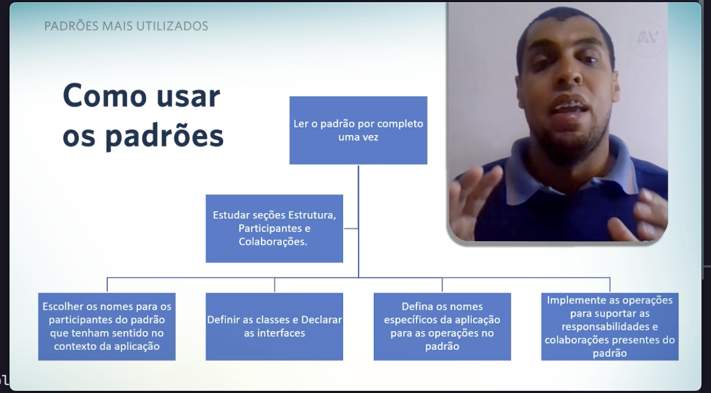
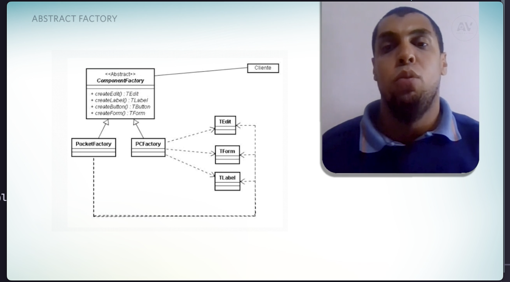

# Unidade 4

### Desenvolvimento PHP - inspire-se

- sua importância (backend)
- php x banco de dados >>> diferencial?
- framework necessario?? -- laravel -- framework limita muito... --- zend
- conselho pra trabalha com php

### videoaula und 4

##### Desenvolvimento de software para WEB

#### Padroes mais utilizados....

padroes de projetos > +++ solucoes ja aprovadas..

- menos gasto de energia/tempo
- como selecionar um padrao de projeto ja existente?
  > > > pega o que os pares ja validaram... e utiliza como base
  > > > considerar como eles solucionam os problemas...
  > > > solucao x foi aprovada mas nao resolveu integralmente todos problemas de determinado problema
  > > > estudar como padroes se relacionam... se integram
  > > > estudar as semelhanças entre os padroes e uma boa

#### como usar os padroes

padroes sao catalogados porque facilitam a aplicacao de uma padronizacao nos seus proprios metodos

##### Abstract Factory

- a intenção é fornecer uma interface para familia de objetos....
- deseja isolar a aplicação de uma classe concreta...
- você quer isolar a vertente da aplicação...
- quando vai utilizar?? >>>

  - um sistema deve ser independente de como seus produtos sao criados, compostos ou representados.
  - o sistema deve ser configurado como um produto de uma familia de multiplos produtos.
  - quando uma familia de objetos for projetada para ser usada em conjunto, e você necessita garantir essa restrição.
  - voçê quer fornecer uma biblioteca de classes de produtos e quer revelar somente suas interfaces, não suas implementações

  

- abstract factory isola as classes concretas
- ele torna facil a troca de familias de produtos.
- ele promove a harmonia entre os produtos.
- e dificil de suportar novos tipos de produtos. // desvantagem.

#### Singleton

- Garante que um objeto tera somente uma unica instância
- a classe gera somente um unico objeto e tem escopo unico para a aplicação, você controla o número de instâncias criadas.
- pc - tablet - notebook -> unica modelagem com unica instância.

- unico servidor corporativo integrado com os aparelhos.
- a mesma informacao e unica para todos ambientes logados no sistema
- acesso pode ser controlado a uma instancia unica.
- nomes reduzidos
- permite refinamento de operacoes.
- permite variavel numero de instancias
- - flexivel.
