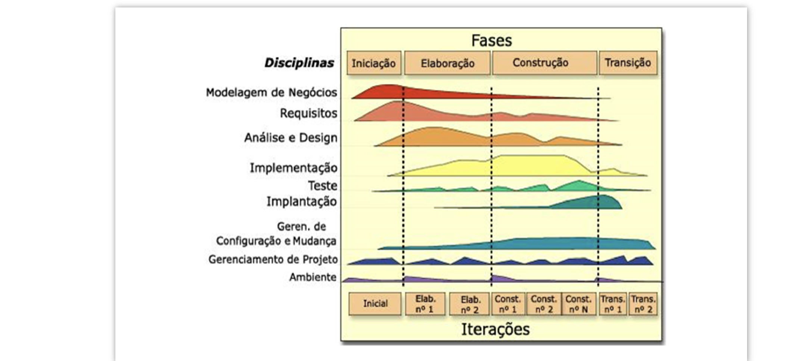
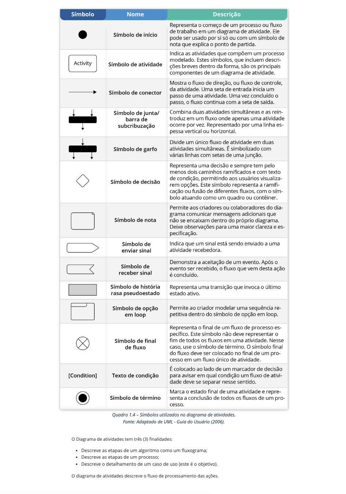

# Engenharia de Software e UML

## Introdução à Engenharia de Software

A engenharia de software é a disciplina que lida com padrões de projetos de software em computação. Utiliza a UML (Unified Modeling Language) para levantar requisitos, realizar análises e modelar artefatos que comporão o sistema. UML é um padrão crucial para o paradigma de Orientação a Objetos (OO) e é uma ferramenta central no RUP (Rational Unified Process).

### Diagramas UML

- **Diagrama de Caso de Uso**: Mapeia funcionalidades do sistema e suas interações com atores.
- **Diagrama de Atividades**: Foca em tarefas como processos, detalhando cada etapa.

## Projeto de Software Orientado a Objetos com UML

O Projeto Orientado a Objetos e o RUP são complementares. O RUP é um framework de processos que busca garantir a produção de software de alta qualidade, enfatizando a iteração e as melhores práticas de especificação e projeto.

### Fases e Disciplinas do RUP

_#PraCegoVer: Descrição da imagem._

#### As fases do RUP incluem:

1. **Concepção**: Estabelece um caso de negócio para o sistema.
2. **Elaboração**: Entendimento do domínio do problema e desenvolvimento do plano de projeto.
3. **Construção**: Desenvolvimento e integração do sistema.
4. **Transição**: Transferência do sistema para o ambiente do usuário final.

### Workflows Principais

| Workflow (Processo)                     | Descrição de funcionamento                                          |
| --------------------------------------- | ------------------------------------------------------------------- |
| Modelagem de Negócios                   | Modelagem dos processos de negócio usando casos de uso.             |
| Requisitos                              | Identificação e modelagem dos requisitos do sistema.                |
| Análise e Projeto                       | Criação e documentação do modelo de projeto.                        |
| Implementação                           | Implementação e estruturação dos componentes do sistema.            |
| Teste                                   | Teste iterativo realizado juntamente com a implementação.           |
| Implantação                             | Distribuição e instalação do produto nos locais de trabalho.        |
| Gerenciamento de Configuração e Mudança | Gestão de mudanças no sistema.                                      |
| Gerenciamento de Projetos               | Gerenciamento do desenvolvimento do sistema.                        |
| Ambiente                                | Disponibilização de ferramentas apropriadas para o desenvolvimento. |

### Práticas do RUP segundo Sommerville

- Desenvolvimento iterativo do software.
- Gerenciamento de requisitos.
- Uso de arquiteturas baseadas em componentes.
- Modelagem visual do software usando UML.
- Verificação da qualidade do software.
- Gerência e controle de mudanças do projeto.

## Requisitos de Software

### Engenharia de Requisitos

Engloba atividades para a produção e manutenção do documento de requisitos. Inclui:

- Elicitação de requisitos.
- Análise de requisitos.
- Documentação de requisitos.
- Validação de requisitos.
- Gerenciamento de requisitos.

### Classificação de Requisitos

Os requisitos são essenciais para definir funcionalidades, restrições e outras propriedades do sistema. São classificados em:

- **Requisitos Funcionais (RF)**: Descrevem as funcionalidades e serviços do sistema.
- **Requisitos Não-Funcionais (RNF)**: Definem propriedades e restrições do sistema como tempo, espaço e qualidade.
- **Requisitos de Domínio**: Relacionam-se com as políticas e normas do negócio.

#### Exemplos de Requisitos Funcionais

- RF01: O sistema deve permitir o cálculo de gastos diários até anuais.
- RF02: O sistema deve permitir a consulta de informações gerenciais.

#### Exemplos de Requisitos Não-Funcionais

- RNF01: O tempo de resposta do sistema não deve ultrapassar 30 segundos.
- RNF02: O sistema deve consultar o estoque em até 10 segundos.

### Vamos Praticar

Qual é a fase do RUP que inclui o refinamento e expansão dos casos de uso, requisitos não funcionais e a descrição da arquitetura?

- a) Concepção
- b) Construção
- c) Elaboração
- d) Produção
- e) Transição

# Requisitos de Software

## Definição de Requisitos

Segundo o Dicionário eletrônico Houaiss (2009, online) e o IEEE Standard Glossary of Software Engineering Terminology (1990), um requisito é uma condição ou capacidade necessária para um usuário resolver um problema ou alcançar um objetivo dentro de um sistema ou componente, com uma representação documentada.

## Engenharia de Requisitos

Esta área da engenharia de software envolve várias atividades focadas na produção e manutenção de um documento de requisitos. Pressman e Maxim (2016) destacam que a engenharia de requisitos serve como uma ponte entre a concepção e a construção do projeto.

### Principais Atividades da Engenharia de Requisitos

- **Elicitação de requisitos**: Descobrir, explicitar e obter informações sobre os requisitos.
- **Análise de requisitos**: Estudar e entender profundamente os requisitos coletados.
- **Documentação de Requisitos**: Registrar todos os requisitos em documentos formais.
- **Validação de requisitos**: Assegurar que os requisitos atendam às necessidades dos stakeholders.
- **Gerenciamento de requisitos**: Administrar todas as mudanças relacionadas aos requisitos ao longo do projeto.

## Classificação de Requisitos

Conforme a Norma ISO/IEC 9126, os requisitos são avaliados em seis características de qualidade:

- **Funcionalidade**: Adequação das funções que o software executa.
- **Usabilidade**: Esforço necessário para usar, aprender e operar o sistema.
- **Confiabilidade**: Frequência de falhas e capacidade de recuperação do sistema.
- **Eficiência**: Desempenho do sistema em relação ao uso de recursos.
- **Manutenibilidade**: Facilidade de modificação e correção do sistema.
- **Portabilidade**: Facilidade de transferir o sistema para outros ambientes.

### Tipos de Requisitos

1. **Requisitos Funcionais (RF)**: Descrevem as funcionalidades e serviços que o sistema deve fornecer.

   - **Exemplos**:
     - RF01: O sistema deve permitir o cálculo dos gastos diários, semanais, mensais e anuais com o pessoal.
     - RF02: O sistema deve permitir consultar informações gerenciais operacionais da empresa.

2. **Requisitos Não-Funcionais (RNF)**: Especificam critérios que podem ser usados para julgar a operação de um sistema, em vez de comportamentos específicos.
   - **Exemplos**:
     - RNF01: O tempo de resposta do sistema não deve ultrapassar 30 segundos.
     - RNF02: O sistema deve consultar o estoque em até 10 segundos.

### Quadro 1.2: Propriedades e Medidas dos Requisitos Não Funcionais

| Propriedade/Característica          | Medida/Referência                                                        |
| ----------------------------------- | ------------------------------------------------------------------------ |
| **Velocidade (Eficiência)**         | Tempo de Processamento de transações; Tempo de Resposta.                 |
| **Tamanho**                         | Capacidade em K bytes; Quantidade de memória RAM ocupada.                |
| **Facilidade de Uso (Usabilidade)** | Projeto de interface; Tempo de treinamento; Quadros de ajuda.            |
| **Confiabilidade**                  | Tempo médio entre falhas; Taxa de ocorrências de falhas.                 |
| **Robustez**                        | Tempo de reinício após falhas; Percentual de eventos causando falhas.    |
| **Portabilidade**                   | Capacidade de operar em diferentes ambientes.                            |
| **Segurança**                       | Políticas de Acesso e Segurança, como criptografia e políticas de senha. |
| **Disponibilidade**                 | Capacidade do sistema estar sempre operacional.                          |

_Fonte: Adaptado de Sommerville (2011, p.63)._

Estes detalhes ajudam a assegurar que o software desenvolvido atenda às expectativas e necessidades dos usuários, além de garantir a qualidade e a eficiência necessárias para o ambiente de aplicação.

# Requisitos de Domínio ou Regra de Negócios

Requisitos de Domínio ou Regra de Negócios são declarações que definem políticas, condições ou restrições essenciais dentro de uma organização, representando o conhecimento profundo do negócio. Eles estabelecem diretrizes gerais para o sistema que são derivadas das normas, políticas e legislações do negócio.

## Exemplos de Regras de Negócio

- **RNF01**: O valor total de um pedido é igual à soma dos totais dos itens do pedido acrescido de 10% de taxa de entrega.
- **RNF03**: Um aluno não pode se inscrever em mais de seis disciplinas por semestre letivo.

Estas regras de negócio variam entre empresas e são fundamentais para o funcionamento dos sistemas conforme as políticas organizacionais específicas.

## Estudo de Caso – Bibliocultura

### Descrição do Sistema

Deseja-se desenvolver um sistema para uma rede de bibliotecas chamada Bibliocultura. Cada biblioteca na rede possui um código único, nome e região. As obras são cadastradas uma única vez em cada biblioteca, com informações como ISBN, título, autor, ano de publicação, tipo e nome da editora. Usuários cadastrados podem emprestar ou reservar obras, e para cada empréstimo, são registradas as datas de empréstimo e devolução.

### Funcionalidades do Sistema

- **Requisitos Funcionais**:

  - **RF01**: Cadastro de obras com ISBN, título, autor, ano de publicação, tipo e nome da editora.
  - **RF02**: Pesquisa de obras por ISBN, título e autor.
  - **RF03**: Empréstimo e reserva de obras apenas por usuários cadastrados.
  - **RF04**: Emissão de relatórios de obras por editora.

- **Requisitos Não Funcionais**:

  - **Eficiência**:
    - **RNF01**: Pesquisas devem ser realizadas em até 5 segundos.
    - **RNF02**: Emissão de relatórios em até 15 segundos.
  - **Segurança**:
    - **RNF03**: Acesso às consultas e reservas mediante autenticação.
    - **RNF04**: Senhas alfanuméricas de no mínimo 6 caracteres.

- **Requisitos Inversos**:

  - **RI01**: O sistema não inclui negociação ou venda de obras.

- **Regras de Negócio (Requisitos de Domínio)**:
  - **RN01**: Multa diária de R$2,00 por obra em atraso.
  - **RN02**: Bloqueio de 30 dias para novos empréstimos após atrasos.

### Questões de Estudo de Caso

- Vamos praticar a identificação de requisitos funcionais corretos para o sistema Bibliocultura:

  a) I e II, apenas.
  b) I e III, apenas.
  c) III e IV, apenas.
  d) I, II e IV, apenas.
  e) II, III e IV, apenas.

Este estudo detalhado permite uma compreensão clara dos diferentes tipos de requisitos e como eles interagem para formar a base de um sistema de informação complexo como o descrito para Bibliocultura.

# Modelagem de Casos de Uso

## Introdução à Modelagem de Caso de Uso

A modelagem de caso de uso é uma técnica crucial para a elicitação de requisitos, oferecendo uma representação funcional das expectativas do usuário em relação ao sistema. Ela é fundamental no design de diagramas de caso de uso e no detalhamento passo a passo de cada funcionalidade.

## Propósitos dos Diagramas de Caso de Uso

- **Facilitar a Comunicação**: Auxilia no diálogo entre analistas e clientes, mostrando as funcionalidades do sistema do ponto de vista do usuário.
- **Visualizar Funcionalidades**: Permite que os clientes vejam as principais funcionalidades de seus sistemas representadas no diagrama.

## Notação do Diagrama de Caso de Uso

O diagrama de Caso de Uso é composto por:

- **Atores**
- **Casos de uso**
- **Relacionamentos entre estes elementos**

### Elementos do Diagrama

- **Atores**: Representados por um ícone de boneco palito, indicando um usuário ou outro sistema que interage com o sistema.
- **Casos de Uso**: Representados por elipses, descrevem uma função significativa do sistema.

### Tipos de Relacionamentos

- **Associações**: Mostram a interação entre atores e casos de uso. Podem ser bidirecionais ou unidirecionais.
- **Generalizações / Especializações**: Indicam uma relação hierárquica entre atores ou entre casos de uso.
- **Dependências (<<include>>, <<extend>>)**: Especificam como os casos de uso interagem entre si através de inclusão ou extensão.

## Exemplos de Relacionamentos

- **Associação Bidirecional**: Indica interações mútuas entre o ator e o caso de uso (e.g., um cliente e o caso de uso "Comprar Produtos").
- **Associação Unidirecional**: Mostra a direção da interação do ator para o caso de uso, sem retorno (e.g., dados de entrada do cliente para o caso de uso "Comprar Produtos").

## Generalização / Especialização

- **Entre Atores**: Por exemplo, um professor e um coordenador podem compartilhar casos de uso, mas o coordenador tem casos de uso adicionais.
- **Entre Casos de Uso**: Um caso de uso genérico como "Vender Produto" pode ser especializado em "Vender à Vista" ou "Vender Parcelado".

## Dependências Entre Casos de Uso

- **<<Include>>**: Indica que um caso de uso é essencial para outro. Por exemplo, "Emitir Nota Fiscal" é parte integrante de "Processar Pedido".

## Visualizações e Descrições

As figuras representativas de cada elemento do diagrama de caso de uso são cruciais para a compreensão visual das interações e estruturas dentro do sistema.

### Exemplos de Figuras

- **Figura 1.2**: Representação do ator "Cliente".
- **Figura 1.3**: Associação bidirecional entre o ator "Cliente" e o caso de uso "Comprar Produtos".
- **Figura 1.4**: Associação unidirecional mostrando a direção da interação do ator para o caso de uso.
- **Figura 1.5**: Associação unidirecional mostrando a direção da interação do caso de uso para o ator.
- **Figura 1.6**: Generalização/Especialização entre atores.
- **Figura 1.7**: Generalização/Especialização entre casos de uso.

Este resumo detalhado da modelagem de caso de uso destaca sua importância no processo de desenvolvimento de software, proporcionando uma compreensão clara das funções do sistema e suas interações do ponto de vista do usuário.

# Modelagem de Casos de Uso

## Introdução

A modelagem de caso de uso é fundamental no processo de desenvolvimento de software, auxiliando na comunicação dos requisitos e na visualização das funcionalidades do sistema do ponto de vista do usuário.

## Componentes de um Diagrama de Caso de Uso

- **Atores**: Representam os usuários do sistema, podendo ser humanos ou outros sistemas.
- **Casos de Uso**: Representam as funcionalidades do sistema.
- **Relacionamentos**: Incluem associações, generalizações e dependências entre os elementos.

### Tipos de Relacionamentos

- **Associação**: Mostra uma comunicação bidirecional ou unidirecional entre atores e casos de uso.
- **Generalização / Especialização**: Indica uma relação hierárquica onde um ator ou caso de uso pode herdar características de outro.
- **Dependências**:
  - **<<include>>**: Um caso de uso inclui a funcionalidade de outro, indicando uma necessidade obrigatória.
  - **<<extend>>**: Um caso de uso pode estender outro, indicando uma funcionalidade opcional.

## Exemplos de Notação

- **Associação Bidirecional**: Indica que tanto o ator quanto o caso de uso podem iniciar a interação.
- **Associação Unidirecional**: Mostra que a interação é iniciada por um ator ou pelo caso de uso, dependendo da direção da seta.

## Diagramas e Detalhamento

Os diagramas de caso de uso ajudam a ilustrar como os atores interagem com os casos de uso, facilitando o entendimento das funcionalidades oferecidas pelo sistema e como elas são acessadas pelos usuários.

### Detalhamento de Caso de Uso

- **Manter Clientes (UC02)**
  - **Objetivo**: Manutenção dos dados dos clientes.
  - **Atores**: Funcionário.
  - **Fluxo Principal**:
    - O funcionário insere dados do cliente.
    - O sistema valida os dados.
  - **Fluxos Alternativos**:
    - Alterar dados do cliente.
    - Consultar dados do cliente.
    - Deletar dados do cliente.
  - **Fluxo de Exceção**:
    - Dados inválidos ou cliente não localizado.

## Prática

### Exercício de Fixação

Considere um diagrama de caso de uso para uma clínica médica, onde:

- **Atores**: Médico e Secretária.
- **Casos de Uso Principais**: Agendar consulta, realizar consulta, solicitar exames.
- **Relacionamentos**:
  - Generalização entre Médico e Secretária.
  - Associação de inclusão entre Agendar Consulta e Atualizar Dados dos Pacientes.

Analise o diagrama proposto e responda qual dos relacionamentos descritos se enquadra corretamente nas lacunas I a VI:

a) <<include>>, <<extend>>, generalização, associação, <<extend>>, <<include>> e <<include>>
b) <<extend>>, <<extend>>, <<include>>, <<include>>,<<include>>, <<extend>> e <<include>>
c) generalização/especialização, <<include>>, <<extend>>, <<include>>, <<include>>, <<extend>> e <<extend>>
d) generalização/especialização, <<include>>, <<include>>, <<extend>>, <<include>>, <<extend>> e <<include>>
e) <<include>>, generalização/especialização, <<extend>>, <<extend>>, <<include>>, <<include>> e <<extend>>

Este exercício ajuda a entender como relacionar corretamente os atores e casos de uso dentro de um diagrama de caso de uso, aplicando corretamente as notações de UML para representar as dependências e interações dentro do sistema.

# Diagrama de Atividades

## Introdução ao Diagrama de Atividades

O Diagrama de Atividades é uma ferramenta essencial dentro da Unified Modeling Language (UML) para descrever processos dinâmicos. Este diagrama é uma forma avançada de fluxograma, projetado para modelar o fluxo de atividades de uma para outra, destacando como estas são coordenadas para fornecer um serviço ou alcançar um objetivo.

## Propósito do Diagrama de Atividades

- **Modelagem de Fluxo de Atividades**: O diagrama de atividades é usado para representar o fluxo sequencial e as condições de controle entre as atividades.
- **Coordenação**: Serve para descrever como diferentes atividades se coordenam entre si dentro de processos complexos, que podem operar em vários níveis de abstração.

## Características Principais

- **Diagrama Comportamental**: Enfatiza as ações e eventos que ocorrem dentro de um sistema.
- **Coordenação de Atividades**: Ilustra a interação e dependência entre atividades, particularmente útil em sistemas onde múltiplas atividades ocorrem em paralelo ou necessitam de sincronização.

## Exemplo de Aplicação

Num projeto de desenvolvimento de software, por exemplo, o diagrama de atividades pode ser utilizado para planejar o fluxo de desenvolvimento, desde a concepção até a entrega final, incluindo etapas como:

- Requisitos
- Design
- Implementação
- Teste
- Lançamento

Cada uma dessas etapas pode ser detalhada em subatividades que são coordenadas para garantir uma transição suave de uma etapa para a outra.

## Saiba Mais

Para mais informações sobre UML e certificações relacionadas, acesse o site da Object Management Group (OMG), que é o órgão responsável pela regulamentação da UML.

[ACESSE OMG.org](https://www.omg.org)

Este diagrama é particularmente útil para entender e documentar como as atividades específicas de um projeto se inter-relacionam, ajudando na visualização de processos que podem ser complexos e multifacetados.

O Diagrama de atividades tem três (3) finalidades:

Descreve as etapas de um algoritmo como um fluxograma;
Descreve as etapas de um processo;
Descreve o detalhamento de um caso de uso (este é o objetivo).
O diagrama de atividades descreve o fluxo de processamento das ações.

Diagramas de atividades possuem sua importância no processo de desenvolvimento de softwares. Usado para descrever as etapas a serem seguidas por um usuário no uso prático de um sistema, ele possui elementos visuais que descrevem cada etapa de eventos a serem realizados. Nisto, analise os elementos do quadro a seguir e sua descrição.

Dado o quadro acima, assinale a alternativa que faz correta relação entre símbolos e descrição.

a) I, II e III, apenas.
b) I, III e IV, apenas.
c) I, II e V, apenas.
d) II, III e IV, apenas
e) III, IV e V, apenas
