Analise de requisito e analise de negocios.

- foco, funcoes e atribuições
- conversa com cliente -> documentacao
- area de negocio do cliente....

negocios -> ponte entre TI e negocios.

Videoaula 1 -> UML e Diagrama de Atividade
UML -> Linguagem padrao para estrutura de projetos de software

- vizualizacao, especificacao e documentação

UML

- espescificacao
- documentacao
- sub vizualizacao
  -vizualizacao logica

UML -> sistemas complexos de software

- sistema bancario
  transporte
  fincanceiro
  vendas
  ... tudo

diagrama estruturais tratam o aspecto estrutural do ponto de vista do sistema quanto das classes....

diagrama de classes -> repersenta classes do negocio
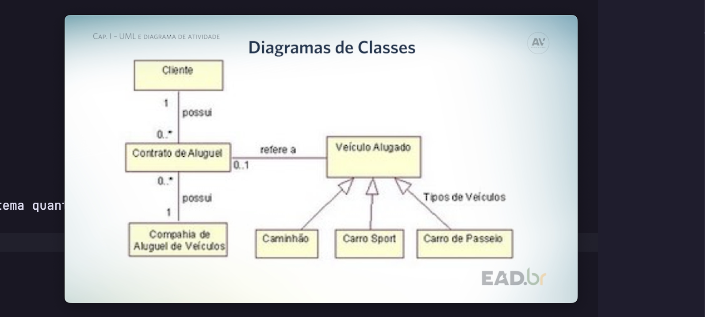

-Diagrama de classes
-Diagrama de objetos -> classes em um instante de tempo e seus relacionamentos
-Diagrama de componentes -> libs, frameworks...
-Diagrama de implementação -> organizacao de elementos utilizados na execucao.
-Diagrama de pacotes -> pacotes e seus relacionamentos
-Diagrama de estrutuar composta -> modelar colaboracoes
-Diagrama de perfil -> Visao ou customizacao de modelo para coisas de x dominio
-Diagrama comportamentais -> documentar aspectos dinamicos do sistema
-Diagrama de caso de uso -> Comportamentos do sistema.
-Diagrama de comunicacao -> Estrutural do projeto
-Diagrama de transicao de estados.
-Diagrama de atividade -> enfatizo fluxo entre uma atividade e outra. - construcao de sistemas executais

CONCEITOS

- atividade
- sub-atividade
- transicao
- acao
- decisao
- raia
- bifurcacao
- sincronizacao - join
- objeto
- envio de sinal
- recepcao de sinal
- regiao
- execao

os diagramas devem conter

- estado de atividade

MODELAGEM DE CASOS DE USO CAP 2
so assisti
CAP 3
so assisti
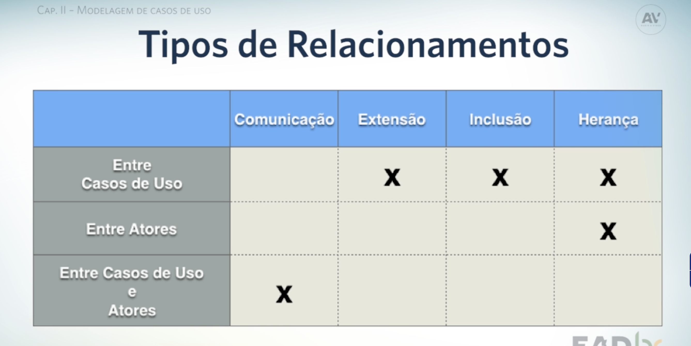

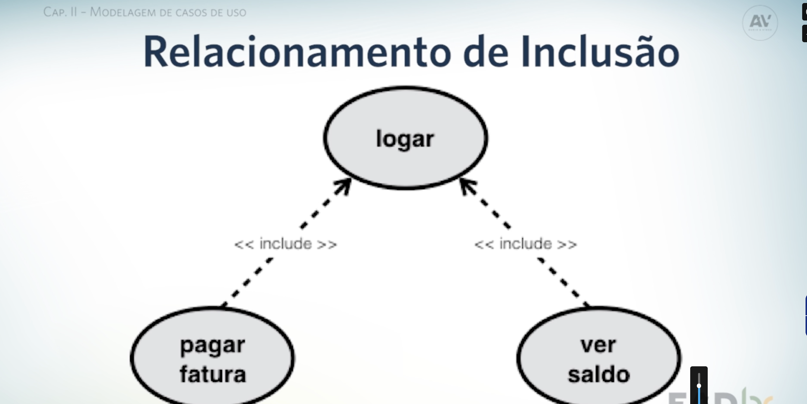
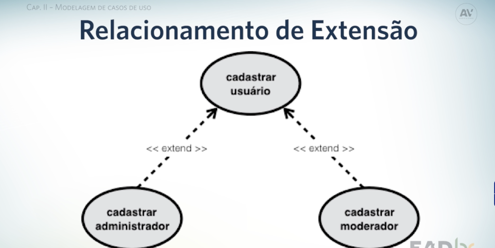
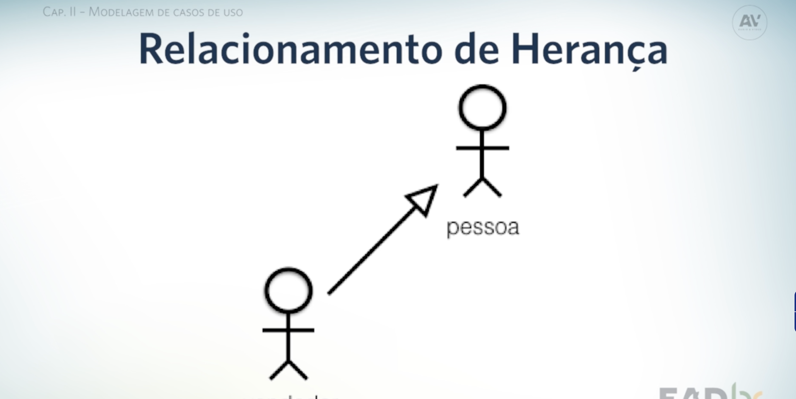
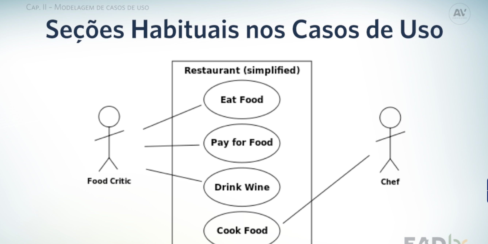

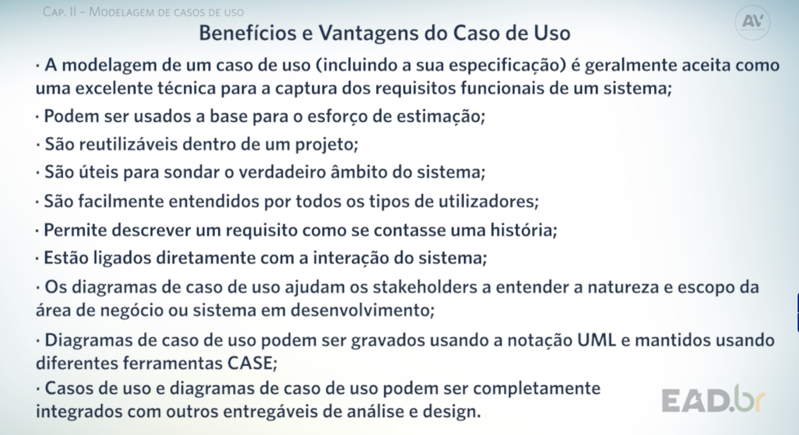
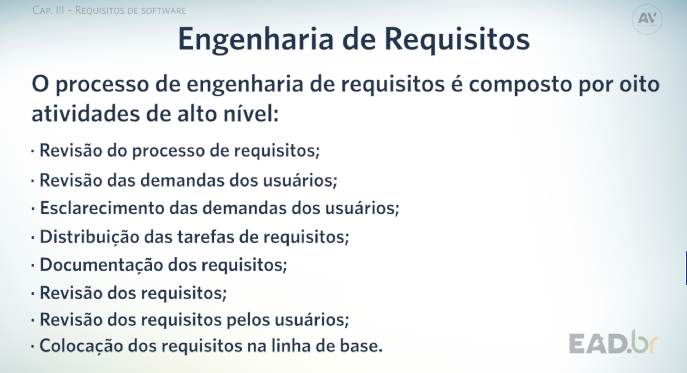

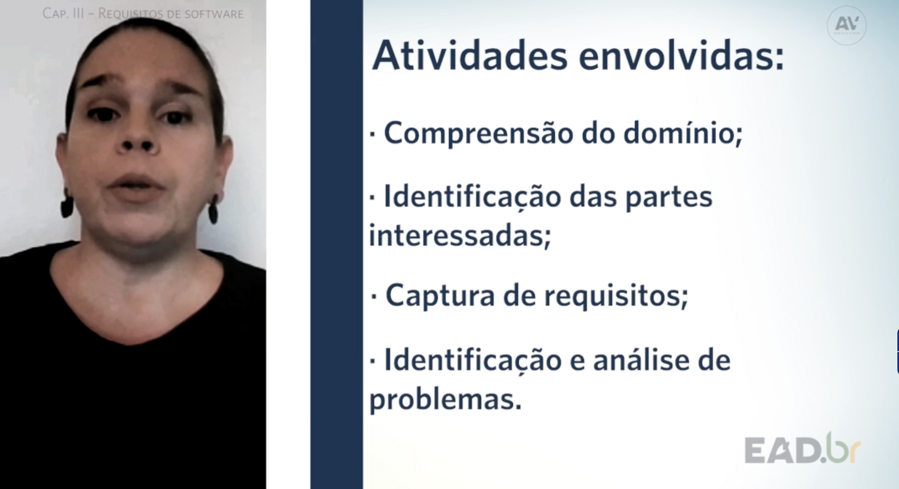

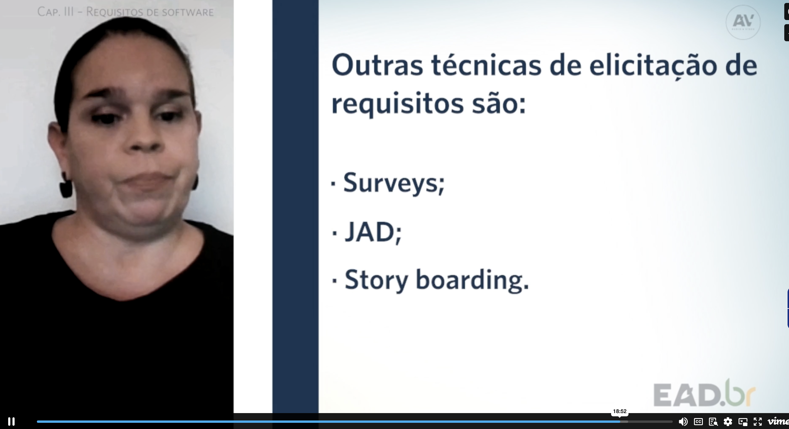
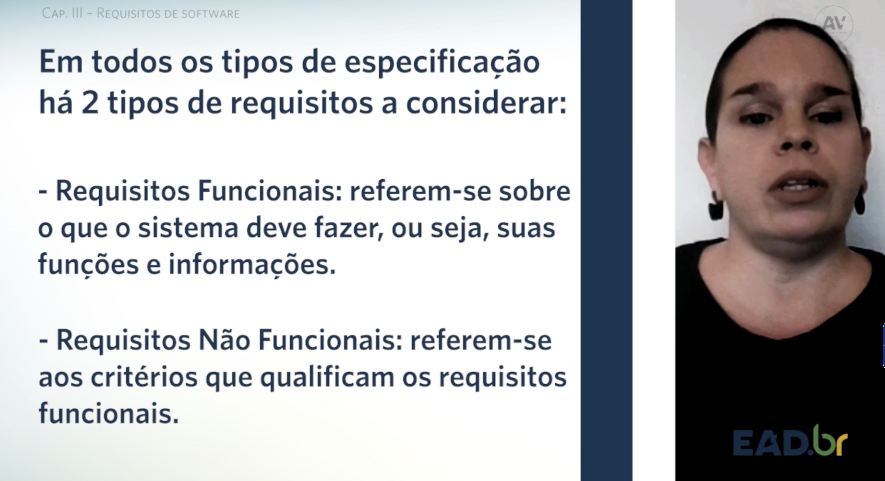
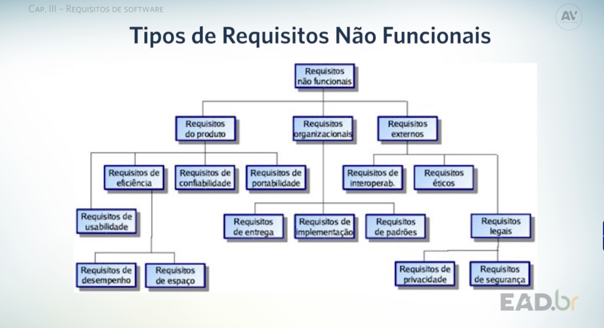

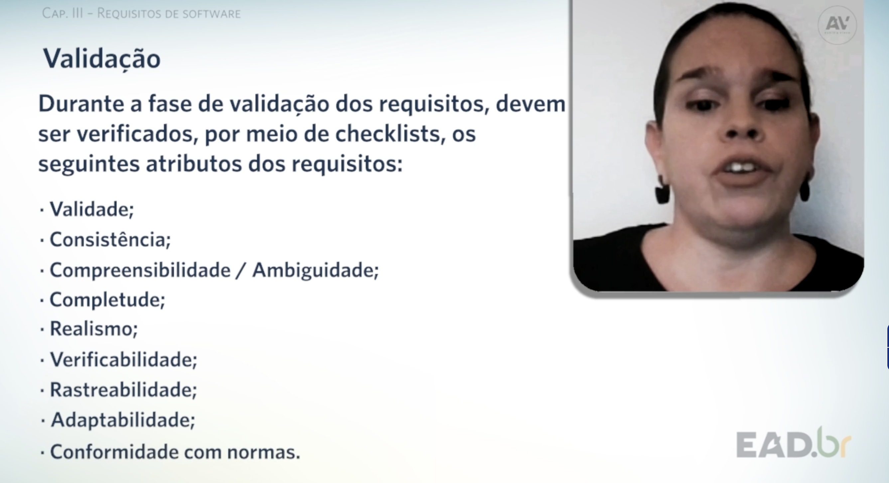
