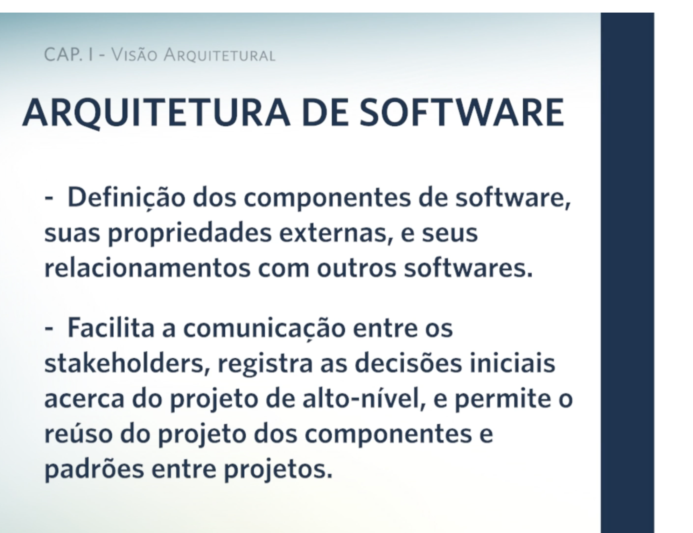
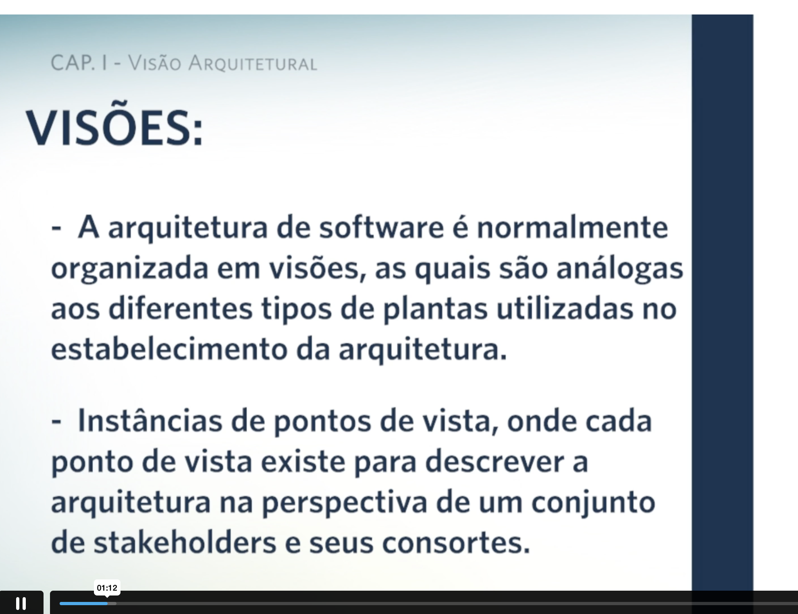
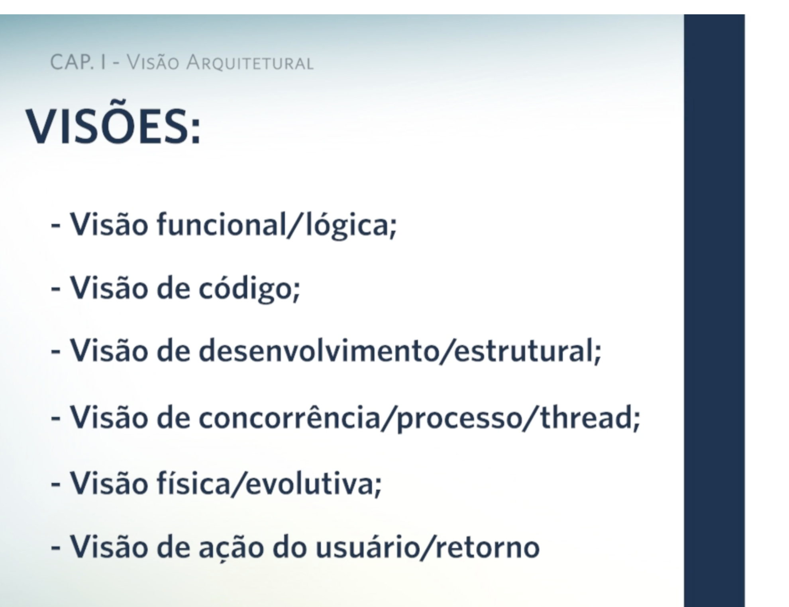
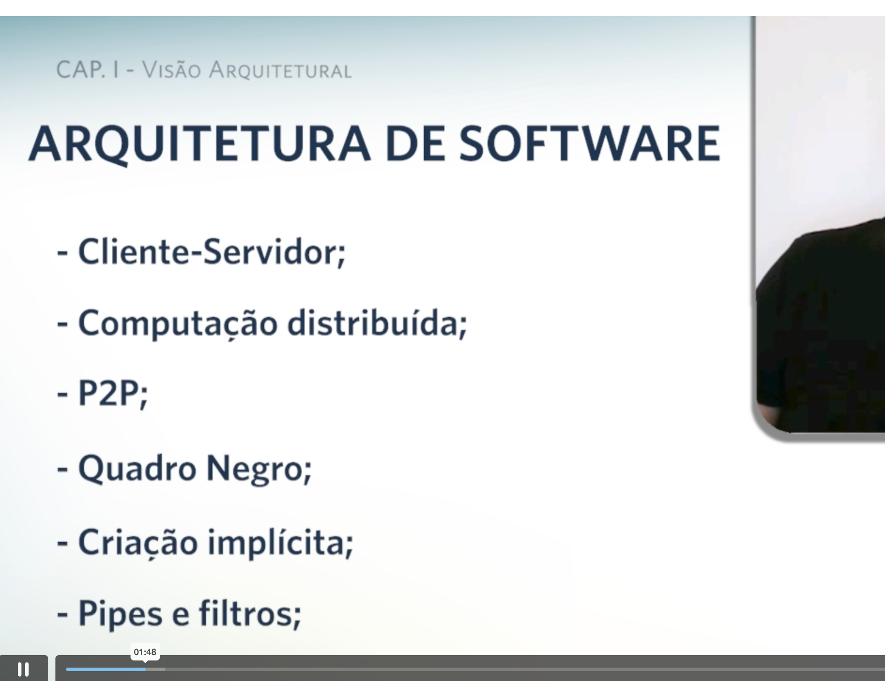
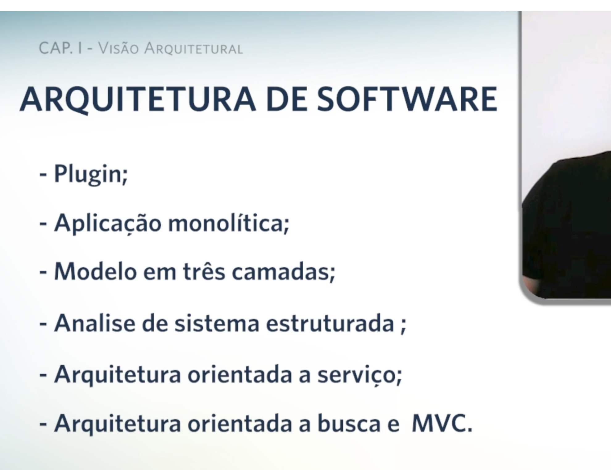
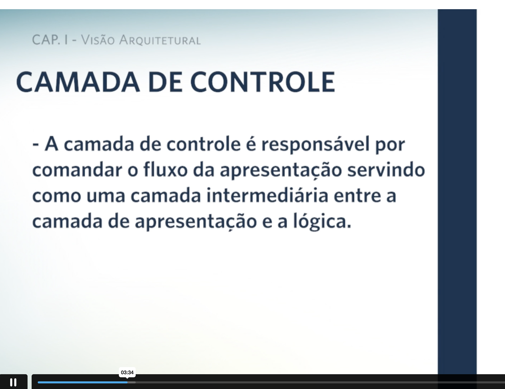
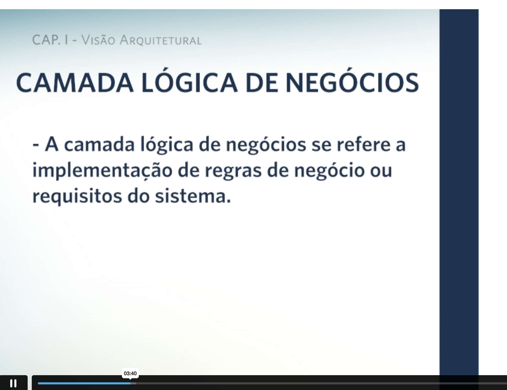
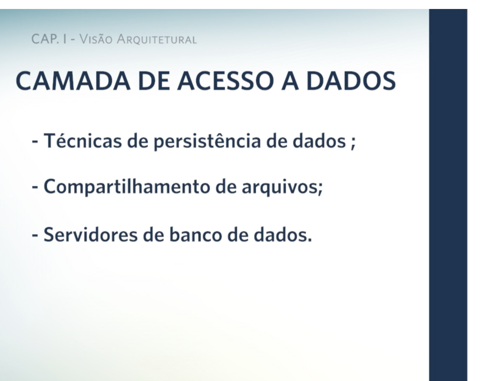

# Inspire-se :: Orientação a objetos e visão arquitetural em Camadas

POO e usado em tudo

Sistema desenvolvido em Camadas.

Camada de interface, camada de dominio de negocio

trablhar em camadas tem divisoes e poo mostra as coisas do mundo real.

# Videoaula

...Varios tipos de arquiteturas....

# Ebook

https://student.ulife.com.br/ContentPlayer/Index?lc=IhA9Paq35NSS7hLlYFfweA%3D%3D&l=IY/UzqfpnlWIYi20bAQZtA%3D%3D&cd=fjAWZksTlfDAFBA0kbjiYA%3D%3D&sl=guYCqCDKjrInxMU3hxsJCg%3D%3D&st=c2nNC6hgYchoVoz1i3JGuw%3D%3D&oi=VLBmY5RzG3ivfTk02LTXUQ%3D%3D

Padrão de Projeto

Um padrão é um modelo com um conjunto de regras que devem ser seguidas em vista a contribuir para trazer benefícios nessa utilização. Para que um padrão seja consolidado, ele passa por testes e avaliações, então, já é o começo do caminho para alavancar os passos seguintes. Iniciar um projeto sem entender qual padrão pode auxiliá-lo provavelmente lhe fará perder muito tempo e dinheiro. E, com bom uso de técnicas e tecnologias, você é capaz de gerenciar as mudanças, versões e releases, ao longo do ciclo de vida do desenvolvimento do seu software.

Por isso, podemos dizer que com o bom uso de padrões de projeto, somos capazes de realizar um mesmo trabalho com menos tempo, menor investimento e mais precisão aos passos do projeto. De acordo com Sommerville (2011), a partir do momento em que são identificados os principais componentes do sistema de software e suas interfaces, é possível organizar os componentes, utilizando um padrão de arquitetura, tal como um modelo cliente-servidor, ou em camadas. Inicialmente, os padrões de arquitetura foram propostos como estilos de arquitetura, termo que ainda é usado por Pressman e Maxim (2016). De modo geral, um padrão de arquitetura representa, de fato, um estilo adotado para projetar a arquitetura de um software.

Nesta unidade, você vai compreender o porquê de se utilizar padrões de projeto e a importância de gerenciar a configuração ao longo do ciclo de vida do desenvolvimento dos sistemas de software.

Arquitetura de Software
A importância da arquitetura de software pode ser percebida à medida em que contribui diretamente para o desempenho, robustez, capacidade de distribuição e manutenibilidade de um sistema de software. O profissional, conhecido como arquiteto de software, é o responsável por levar em consideração os requisitos que foram analisados e especificados pelo analista de sistemas ou analista de requisitos para, então, formular um produto, isto é, o software a ser desenvolvido.

Se na fase de requisitos forem modeladas as funções e comportamentos necessários, o que é para ser implementado deverá estar claro e, agora, o projeto de arquitetura deve criar um modelo de software que vai representar como se deve fazer. Nessa fase será destacada e detalhada essa arquitetura, as estruturas de dados, as interfaces e componentes que serão essenciais para, na próxima fase, implementar o software.

saiba mais
Saiba mais
Em inglês, o termo Padrão de Projetos é chamado de Design Pattern , onde Design significa nesse caso projeto e Pattern é traduzido como padrão. Na engenharia de software, o termo design é utilizado para estabelecer como os requisitos levantados devem ser implementados na construção do software. Para saber mais, acesse o link a seguir.

ACESSAR
A importância de se projetar um software corretamente se dá pelo fato de que essa fase é de extrema relevância para que o produto final seja de qualidade, pois se o modelo de arquitetura não representar um software adequado e esperado, o código que for gerado na implementação não corresponderá ao que foi requerido e, consequentemente, resultará em um software de má qualidade. Afinal, todo novo carro ou nave espacial nasce de um projeto. E acredito que seja bem claro para você o porquê, certo? Sem um projeto, como a equipe que participa no desenvolvimento e fabricação poderá seguir os passos até chegar ao objetivo final, o novo produto? Sem projeto e sem padrões, haveria muito mais trabalho para se desenvolver algo novo.

Portanto, o projeto de software abrange a representação do software a ser desenvolvido e, com isso, pode conter atividades diferentes, de acordo com objetivo de software desejado. Sommerville (2011), Pressman e Maxim (2016) apontam as quatro atividades que podem ser parte do processo de projeto de sistemas de software: projeto de arquitetura, de interface, de componente e de banco de dados.

Uma arquitetura vai além de uma estrutura física, pois ela é, por exemplo, a forma como diversos componentes do andar de um prédio são integrados para formar um todo. Isso também inclui se integrar aos demais andares e ao entorno do prédio e sua vizinhança para, enfim, tratar de detalhes como cores, texturas, iluminação, piso etc., para, então, formar o prédio completo.

A arquitetura do software é, portanto, a estrutura ou estruturas do sistema, que compreendem elementos de software, os elementos visíveis externamente, propriedades desses elementos e os relacionamentos entre eles. As propriedades “externamente visíveis” se referem a essas suposições de que outros elementos podem criar um outro elemento, como serviços, características de desempenho, falhas de manipulação, uso de recursos compartilhados e assim por diante. Assim, os requisitos funcionais ou não funcionais são interpretados de maneira diferente no projeto de software. Mais à frente vamos olhar algumas das implicações dessa definição em mais detalhes.

Padrão de projetos é uma área da engenharia de software responsável por estabelecer diretrizes de diferentes formas de realizar um trabalho de desenvolvimento de software. Dela dependem outras áreas da engenharia de software como a Arquitetura de Software. Sobre a arquitetura de software, assinale a alternativa que apresenta a sua descrição corretamente.

a) É nessa fase do projeto que os requisitos deverão ser levantados.
b) É um modelo com um conjunto de regras que devem ser seguidas em vista a contribuir para trazer benefícios ao projeto.
c) O projeto de arquitetura deve criar um modelo de software que vai representar como se deve fazer.
Feedback: alternativa correta , é nessa fase que o projeto de software irá pôr em prática os requisitos levantados anteriormente.
d) Quatro atividades da arquitetura de software: projeto de arquitetura, de interface, de componente e de banco de dados.
e) Se o modelo de arquitetura não representar um software adequado e esperado, o código que for gerado na implementação corresponderá ao que foi requerido.

Visão Arquitetural - Arquitetura em Camadas

O projeto de arquitetura é o processo para identificar os subsistemas que compõem um sistema e o framework para controle e comunicação do subsistema. É uma descrição da arquitetura do software. Na fase inicial do processo de concepção do sistema, representa a ligação entre a especificação e os processos de projeto. Muitas vezes é realizada em paralelo com atividades de especificação. Trata-se de identificar os principais componentes do sistema e suas comunicações.

Abstrações sobre a arquitetura:

Arquitetura em pequena escala – preocupa-se com a arquitetura dos programas individuais. Nesse nível, estamos preocupados com a maneira como um programa individual é decomposto em componentes.
Arquitetura em grande escala – preocupa-se com a arquitetura de sistemas corporativos complexos que incluem outros sistemas, programas e componentes do programa. Esses sistemas empresariais estão distribuídos em diferentes computadores, que podem ser possuídos e geridos por diferentes empresas.
Veja as vantagens da arquitetura explícita no infográfico a seguir:
Comunicação de stakeholders
A arquitetura pode ser usada como um foco de discussão pelos stakeholders do sistema.

freepik.com
Os padrões são formas de apresentar, compartilhar e reusar o conhecimento sobre sistemas de software, conforme afirma Sommerville (2011). Esse padrão se trata de uma descrição abstrata, estilizada, de boas práticas experimentadas e testadas em diferentes ambientes e sistemas e, por isso, para se tornar um padrão, significa que essa arquitetura foi bem-sucedida em sistemas já implementados. Certamente, esse padrão deve descrever quando ele é mais adequado e outros detalhes que abordam pontos fracos e fortes.

# Arquitetura Cliente-Servidor

Não existe apenas um padrão de arquitetura para sistemas. Existem alguns padrões e, por isso, é preciso entender cada um deles para saber sob qual deles um sistema deverá estar posto. Existem diferentes formas de se estruturar servidores de aplicações, mas todas elas se baseiam no princípio da arquitetura cliente-servidor, onde uma aplicação tem seus arquivos e dados armazenados em uma estrutura maior e mais robusta (lado Servidor) e são acessadas por interfaces (lado Cliente).

A Arquitetura em Camadas é a decomposição de sistemas complexos em partes menores e focadas em seu papel (camada) para facilitar a compreensão do mesmo, como também, facilitar a manutenção desse sistema.

Um exemplo simples e de fácil compreensão de sistema em camada é um Sistema Web. Geralmente ele será dividido em três (3) camadas: o chamado front-end (que compreende basicamente ao uso das linguagens html, css, js) é onde temos a camada de apresentação (interface) e exibição dos dados (1ª camada), sendo essa camada não apropriada para tratar regras de negócio e processar grande volume de informações. A camada responsável por isso é a chamada back-end (representada por linguagens de programação dinâmicas como PHP, Python, Ruby, C#, Java etc.) que possui estrutura e controle do lado servidor para processar dados e tratar regras de negócio (2ª camada). Nisso, uma terceira camada entra em cena, para persistir (armazenar) os dados, chamada de camada de dados, contendo o banco de dados, que é o responsável pela persistência e armazenamento deles.

saiba mais
Saiba mais
A arquitetura Cliente-Servidor funciona como uma base para todas as formas de arquitetura e desenvolvimento de aplicações web. Na prática, todo sistema web tem o lado demandante (cliente) e o solicitado (servidor). Quanto a estrutura de acesso a dados, também é a mesma, com clientes solicitando e servidores oferecendo serviços. Portanto, a arquitetura Cliente-Servidor não é uma concorrente das demais, mas se apresenta como um padrão comum, com as funções de servidores ficando bem claras no objetivo de atender o lado cliente. Para saber mais, acesse o link a seguir.

ACESSAR
Existem outros exemplos de padrão de projetos que, a seguir, vamos detalhar mais como o padrão bastante comum na web chamado MVC (Model, View, Controller) e suas variantes.

# Padrão MVC

A arquitetura da web hoje é baseada no modelo utilizado desde os primórdios da web até os dias atuais, que é o Cliente-Servidor. Com a expansão da capacidade dos computadores, diversas empresas passaram a disponibilizar servidores para terceiros, iniciando os chamados servidores de hospedagem. Esse modelo, onde o cliente se conecta através da internet a servidores que fornecem os dados necessários e solicitados pelos usuários, é uma estrutura que possui grande aceitação e parece consolidada mesmo com as tecnologias mais recentes.

O MVC é uma das principais formas de representação de camadas. O Model é o Modelo de camada responsável pela modelagem de dados, onde os componentes se preocupam em manter ou persistir os dados no sistema. Dentro de um software é a parte da programação que irá interligar o sistema ao SGBD (Sistema Gerenciador de Banco de Dados). View é a camada de visão, representa a interface do sistema, vinculada ao que chamamos de Front-end . A programação é voltada para criação das telas e interface do usuário com o sistema. Controller é a camada de Controle onde a programação é voltada para a lógica do negócio. Nessa camada é onde se estabelece a conexão entre a interface da View e os dados que estão no servidor, na camada Model . Aqui são utilizadas linguagens de programação mais dinâmicas, capazes de gerar lógica ao sistema e conectar o mesmo ao banco de dados onde estarão as informações do software criado.

Um sistema web tradicional é dividido em camadas. Entenda camada como uma separação em níveis onde eles vão do usuário até o servidor web. O MVC é um modelo de arquitetura web em 3 camadas que divide cada uma delas como responsável por parte de uma aplicação web. As três camadas desse modelo representam a:

### Apresentação (View) :

trata-se da parte visual, a interface dos sistemas. Nessa camada, o usuário pode “navegar” e utilizar o sistema, interagindo, inserindo e requisitando dados através de formulários, botões e hiperlinks. Em geral, não processa muita informação, ou seja, não contém elementos mais profundos de regras de negócios do sistema. É responsável por requisitar dados dos servidores de dados e web.

### Lógica (Controller) :

camada onde se localizam as regras de negócio. Na prática são servidores de arquivos que hospedam as linguagens de programação chamadas de back-end. É a camada que requer maior poder computacional para permitir acesso de vários usuários ao mesmo tempo com distintas requisições.

### Dados (Model) :

a camada de gerenciamento de dados é onde se conectam aos bancos de dados. Requer uma maior segurança, visto que todos os dados do sistema e de seus usuários estão ali. Também são servidores com poder computacional de maior porte, principalmente quanto à capacidade de armazenamentos ( Storage ), pois os dados aumentam em uma escala cada dia mais gigantesca.
Esse modelo de arquitetura ainda é bastante utilizado, mesmo com outros mais emergentes surgindo. Ele garante que diversos tipos de dispositivos possam ter acesso aos dados, inclusive os equipamentos da emergente tecnologia de Internet das Coisas.

Arquitetura Monolítica
Assim como vimos que a arquitetura cliente-servidor é uma forma padrão de disposição de sistemas na web, a arquitetura monolítica também utiliza a arquitetura em camadas como forma de disponibilizar dados de uma aplicação desenvolvida.

Essa arquitetura tem por característica dividir funcionalidades de um sistema em partes, porém, com um mesmo núcleo. A proposta da arquitetura monolítica é o uso de modelos como containers , onde cada um tem a estrutura necessária para suportar uma aplicação por inteiro, como por exemplo um sistema on-line de uma clínica onde o usuário pode utilizar o aplicativo da unidade de saúde para agendar uma consulta e, ali por trás existe um back-end com a lógica do negócio de modo que a empresa possa gerenciar as consultas e pagamentos realizados também. Logo, uma mesma base de programação existente pode ser tanto clientes como os funcionários da empresa que, neste caso, estarão usando a mesma lógica de sistema, porém com interfaces diferentes. Para um cenário como esse, a arquitetura monolítica se mostra como uma boa alternativa.

Na Figura 2.1 a seguir, é apresentado um exemplo de um ERP com diferentes módulos em modelo monolítico.

Figura 2.1 - Estrutura Monolítica
Fonte: Elaborada pelo autor.
#PraCegoVer: A imagem exibe uma arquitetura monolítica de software ERP com um banco de dados Monolítico, a arquitetura monolítica é uma arquitetura centralizada que compartilha um mesmo recurso no caso está compartilhando um banco de dados único com um conjunto de sistemas distintos e dependentes.

O esquema apresentado na Figura 2.1 demonstra de maneira simples a ideia da arquitetura monolítica em que cada módulo do sistema ERP ( Enterprise Resource Planning ) é um tipo de sistema de gestão bastante difundido nos negócios. Nessa estrutura, cada módulo do sistema permanece unificado em um mesmo servidor e, de maneira direta, todos têm acesso a uma mesma base de dados, chamada de Banco de Dados Monolítico. Assim, toda a estrutura de uma aplicação permanece fisicamente em um mesmo servidor, de maneira centralizada, mesmo que haja a divisão em camadas, essa divisão acaba sendo transparente ao usuário.

## Arquitetura de Microsserviços

Microservices ou Microsserviços são estruturas relativamente recentes. A AWS, subsidiária da gigante do varejo Amazon, descreve Microsserviços como “[...] uma abordagem arquitetônica e organizacional do desenvolvimento de software na qual o software consiste em pequenos serviços independentes que se comunicam usando APIs bem definidas. Esses serviços pertencem a pequenas equipes auto suficientes” (AWS AMAZON, 2019, on-line ). A Figura 2.2 apresenta a estrutura da arquitetura de Microsserviços.

Figura 2.2 - Arquitetura de Microsserviços
Fonte: Elaborada pelo Autor.
#PraCegoVer: A Imagem exibe a arquitetura de Microserviços consiste em subdividir o sistemas em componentes menores, os microsserviços, o primeiro acesso se dá por meio de diferentes dispositivos que vão se comunicar a camada de interface com diferentes aplicações se comunicando com servidores com diversos tipos de módulos ou serviços distribuídos.

Conforme a Figura 2.2 mostra, a arquitetura de microsserviços quebra o sistema em partes menores. Independentemente do tipo de dispositivo que você utilize para acessar o sistema (1), a camada de interface (2), o acesso aos dados será por aplicações diferentes. Na camada de servidor (3) os diversos tipos de módulos ou serviços que uma aplicação possa servir são divididos em partes menores, realizando uma subdivisão do servidor, não sobrecarregando apenas uma máquina, mas dividindo o trabalho em servidores distintos. Se você analisar friamente, não é apenas por questão de simples escolha, mas por razões como a escalabilidade das aplicações e a forma de manter servidores de dados e seus serviços inclusos.

Ao compararmos os modelos de arquitetura monolítica e microsserviços podemos notar diferenças em sua estrutura que tornam a escolha entre um e outra bem distinta. Para Batista (2018) existem diversos conflitos que podem surgir no modelo monolítico, como a questão da escalabilidade (capacidade de um sistema em expandir ou crescer), na dificuldade de se adicionar novas tecnologias ao processo e treinar novos profissionais de uma equipe de desenvolvimento. Em contraponto, Batista ainda afirma que “microsserviços é a separação de elementos de funcionalidade colocados em serviços separados, dessa forma tornando-os totalmente autônomos e totalmente independentes” (BATISTA, 2018, p. 411). Na comparação direta, o modelo de microsserviços se apresenta como uma alternativa menos burocrática para uma possível expansão do sistema e futura manutenção do mesmo.

A criação de um sistema baseado na Web em três camadas apresenta benefícios para quem desenvolve o sistema e para os responsáveis por manter essa aplicação em funcionamento. Em virtude de ele ser dividido em três camadas, cada uma delas tem uma função específica dentro do seu contexto. Sobre a camada de apresentação, assinale a alternativa correta.

a) É a etapa do processo de desenvolvimento de um sistema responsável pelo levantamento de requisitos.
b) É a interface do sistema, que são as telas e as formas como o usuário interage com o sistema ou aplicativo.
Feedback: alternativa correta , a camada de apresentação é também chamada de aplicação ou interface. É a parte responsável pelos códigos chamados front-end, com linguagens como HTML, CSS e Javascript.
c) É parte do sistema em que está o código-fonte, também chamado de back-end, responsável pela lógica do sistema.
d) É capaz de gerar e armazenar dados em servidores Web. Utiliza os chamados SGBDs para tal função.
e) É a camada "ponte" entre as camadas lógicas e de dados de um sistema.

Diagrama de Classes de Projeto e sua Visão em Camadas

Indo além dos algoritmos e estruturas de dados da computação, projetar e especificar a estrutura geral do sistema surge como um novo tipo de problema. Questões estruturais incluem organização bruta e estrutura de controle global. O uso de protocolos para comunicação, sincronização e acesso a dados, atribuição de funcionalidade para projetar elementos, distribuição física, composição de elementos de design, escala e desempenho e seleção entre alternativas de design são características que precisam ser levadas em consideração ainda no projeto de software.

Nesse contexto, o uso de diagramas é uma forma de auxiliar no entendimento de práticas importantes quanto ao desenvolvimento de uma aplicação. Após ampliar a visão para um ponto de vista arquitetural em camadas, o diagrama de classes de projeto explica o funcionamento do diagrama de sequência descrevendo as interações de um método que interage e percorre cada camada do modelo, com troca de parâmetros.

O diagrama de classes de projeto é um modelo orientado a objetos em camadas e esse modelo é orientado a objetos do modelo BCE ( Boundary- Fronteira, Control-Controle e Entity-Entidade ) ampliando-se a visão do modelo conceitual para o modelo de projeto.

No diagrama de sequência a ênfase está nas representações e na interação entre os objetos de um cenário, realizado por operações ou métodos (procedimentos ou funções). Pensa-se no Caso de Uso (funcionalidade), seu fluxo de execução como método (procedimento ou função), as interações e chamadas dos métodos perfazendo a comunicação entre cada camada do modelo.

Deve especificar as classes de software e as interfaces da aplicação não somente das entidades conceituais. O diagrama de classes de projeto possui informação tipicamente incluída, como: Classes, associações e atributos; Interfaces, incluindo métodos e constantes; Métodos; Informação de tipo de atributos; Navegabilidade e Dependências (SAUVÉ, 2014).

Segundo Pressman e Maxim (2016), uma arquitetura de sistema de software compreende:

Uma coleção de componentes de software e de sistema, conexões e restrições.
Uma coleção de partes interessadas do sistema precisa de declarações.
Uma justificativa que demonstra que os componentes, conexões e restrições definem um sistema que, se implementado, satisfaria a coleção de declarações de necessidade das partes interessadas no sistema.
Em geral, é possível modelar arquiteturas de um modo simples, com blocos que representam componentes, que podem estar dentro de caixas, que acoplam subcomponentes. As setas representam a comunicação dos dados de controle entre os componentes, conforme a direção da seta.

Os blocos nem sempre são tão simples ou podem ser representativos do componente, como um banco de dados, um computador, dentre outros, isto é, podem ter formas e características diferentes, o banco de dados, por muitas vezes, é representado por um cilindro, o computador por uma imagem etc. O importante é que ele seja claro, facilite a discussão do projeto entre os stakeholders (os envolvidos e interessados no resultado do projeto) e seja útil para documentar um projeto de arquitetura com seus componentes, interfaces e conexões (SOMMERVILLE, 2011).

No diagrama de sequência a ênfase está nas representações e na interação entre os objetos de um cenário, realizado por operações ou métodos (procedimentos ou funções). Pensa-se no Caso de Uso (funcionalidade), seu fluxo de execução como método (procedimento ou função), as interações e chamadas dos métodos perfazendo a comunicação entre cada camada do modelo.

Classes de Projeto : definição de classes como componentes de software, classes de software. Especifica-se as classes de software e as interfaces da aplicação, não somente das entidades conceituais. Em análise orientada a objetos quando fala-se em diagrama de classes de projeto há três (3) estereótipos de classes que facilitam a análise e visão arquitetural do projeto de sistema.

Sauvé (2014) nos apresenta um passo a passo de como elaborar um diagrama de classes de projeto. Segundo o autor, os pontos mais importantes neste processo são:

Identificar todas as classes que participam da solução em software - Isso é feito pela análise dos diagramas de interação;
Incluí-las num diagrama de classes;
Duplicar os atributos, a partir das entidades associadas no modelo conceitual;
Adicionar nomes de métodos descobertos nos diagramas de interação;
Adicionar informação de tipo aos atributos e métodos;
Adicionar as associações necessárias para a visibilidade de atributos;
Adicionar setas às associações para indicar a direção da visibilidade de atributos;
Adicionar linhas de relações de dependência para indicar a visibilidade que não seja de atributo.
A Figura 2.3 apresenta um exemplo de diagrama de classes de um projeto de software.

Figura 2.3 - Diagrama de classes para uma classe chamada Sistema
Fonte: Pressman e Maxim (2016, p. 189).
#PraCegoVer: Diagrama de classes – classe: Sistema, com os atributos IdSistema, numTelefoneVerificado, statusSistema, tempoAtraso, numTelefone, senhaMestre, senhaTemporaria e numTentativas e os métodos: programa(), exibir(), reiniciar (), consultar(), acionar () e desarmar ().

Na Figura 2.3 ilustrada por Pressman e Maxim (2016), é apresentada uma classe chamada Sistema de um programa qualquer. Na parte superior da figura temos os chamados atributos , que representam as características de um objeto de um sistema no paradigma orientado a objetos. Na parte de baixo estão demonstradas as funções , que são métodos de uma classe que permite a um objeto poder executar ou realizar uma ação como tarefa (no caso os métodos são programa, exibir, reiniciar etc.). Em um diagrama completo, várias classes estarão inseridas e terão uma ligação. Toda relação entre classes, assim como em um diagrama no modelo conceitual, terá um sentido da relação, indicado por setas.

Agregação, Associações e Dependências
No contexto da orientação a objetos, existem conceitos como a herança, capacidade de uma classe herdar característica de outra. Nisso, existem também associações e dependências, afinal uma superclasse gera dependência de suas subclasses. Como exemplo de agregação temos a relação entre uma superclasse e suas subclasses, conforme nos mostra a Figura 2.4 a seguir:

Figura 2.4 - Classe composta de agregação
Fonte: Pressman e Maxim (2016, p. 196).
#PraCegoVer: Diagrama de classes com associação de composição, tem-se a classe principal Jogador, e as classes de composição: CabeçaJogador, CorpoJogador, BraçosJogador e PernasJogador.

A Figura 2.4 apresenta um diagrama contendo uma classe chamada Jogador que possui quatro (4) subclasses, chamadas: CabeçaJogador , CorpoJogador , BraçosJogador e PernasJogador . Na agregação, esse diagrama representa que as subclasses agregam valor à superclasse à qual estão ligados, ou seja, representam um complemento de informação através de dados específicos. Logo, um objeto do tipo Jogador poderá ter dados sobre suas características físicas como cabeça, corpo etc.

Existem casos que a associação poderá trazer indicação de multiplicidade.

Isso indica dizer que podem ser determinadas quantas “associações” serão possíveis, como por exemplo “quantos braços e pernas” possui um jogador. A Figura 2.5 apresenta um exemplo de multiplicidade do diagrama da Figura 2.4, da relação entre classes de um jogador.

Figura 2.5 - Diagrama de Classes com Multiplicidade
Fonte: Adaptada de Pressman e Maxim (2016, p. 199).
#PraCegoVer: diagrama de classes com associação de composição com multiplicidades, tem-se a classe principal Jogador, e as classes de composição: CabeçaJogador, CorpoJogador, BraçosJogador e PernasJogador. Uma instância de Jogador é composta de uma instância de CabeçaJogador, Uma instância de Jogador é composta por uma instância de CorpoJogador, Uma instância de Jogador é composto por várias (muitas) instâncias de BraçosJogador e Uma instância de Jogador é composta de várias (muitas) instâncias de PernasJogador.

Na Figura 2.5 temos, então, a relação de multiplicidade que indica a incidência máxima de cada item da relação. Assim, o diagrama indica que cada jogador pode ter apenas uma (1) cabeça, um (1) corpo, várias (ou mais de uma, no caso) de pernas e braços. No caso, o asterisco (\*) representa muitos na cardinalidade de diagramas.

Diagrama de Sequência, de Arquitetura e Implantação

Diagramas baseados em UML ( Unified Modeling Language ) são formas de padronizar um projeto de software. O trabalho nessa área é exemplificado pelo desenvolvimento de linguagens de descrição arquitetônica (ADLs), que são linguagens formais que facilitam a descrição dos componentes e conexões de uma arquitetura. As representações dessa linguagem são geralmente de forma gráfica e fornecem alguma forma de sintaxe "caixa e linha" para especificar componentes e conectá-los. Um diagrama de sequência é um diagrama usado na UML que representa uma sequência de processos, mais especificamente a troca de mensagens entre objetos, na execução de um método.

Um projeto pode ter uma grande quantidade de métodos em classes diferentes, pode ser difícil determinar a sequência global do comportamento. O diagrama de sequência representa essa informação de uma forma simples e lógica. É uma solução dinâmica de modelagem em UML bastante usada porque incide especificamente sobre linhas da vida, ou os processos e objetos que vivem simultaneamente, e as mensagens trocadas entre eles para desempenhar uma função antes do término da linha da vida.

Descreve a maneira como os grupos de objetos colaboram em algum comportamento ao longo do tempo. Ele registra o comportamento de um único caso de uso e exibe os objetos e as mensagens passadas entre esses objetos no caso de uso.

Logo, podemos dizer que o Diagrama de Sequência é uma das ferramentas UML usadas para representar interações entre objetos de um cenário, realizadas através de operações ou métodos (procedimentos ou funções). Esse diagrama é construído a partir do Diagrama de Casos de Usos. Primeiro, define-se qual o papel do sistema ( Use Cases ), depois, é definido como o software realizará seu papel (Sequência de operações).

O diagrama de sequência dá ênfase à ordenação temporal em que as mensagens são trocadas entre os objetos de um sistema. Entende-se por mensagens os serviços solicitados de um objeto a outro, e as respostas desenvolvidas para as solicitações.

reflita
Reflita
A Documentação de software é composta de diversos elementos que, em conjunto trazem antecipação de problemas a serem resolvidos. Mas, todo projeto de Software precisa de documentação?

Características do Diagrama de Sequência
Para entendê-lo, é importante conhecer a função da Linguagem de modelagem unificada. UML é um conjunto de ferramentas de modelagem que orienta a criação e notação de muitos tipos de diagramas, incluindo diagramas comportamentais, de interação e estruturais.

Um diagrama de sequência é uma espécie de diagrama de interação, pois descreve como, e em qual ordem, um grupo de objetos trabalham em conjunto. Esses diagramas são usados por desenvolvedores de software e profissionais de negócios para entender as necessidades de um novo sistema ou para documentar um processo existente. Diagramas de sequência são conhecidos como diagramas de eventos ou cenários de eventos.

Seus benefícios podem ser referências úteis para empresas e outras organizações. Para Pressman e Maxim (2016, p. 205), “diferentemente de um diagrama de estados, que representa comportamento sem citar as classes envolvidas, um diagrama de sequência representa comportamento descrevendo como as classes passam de um estado para outro”. O emprego de um diagrama de sequência pode se dar dentro das seguintes situações:

Cenário de uso : um cenário de uso é um diagrama de como seu sistema poderia ser utilizado. É ótimo para certificar-se de que você compreendeu a lógica de cada cenário de uso do sistema.
Lógica do método : assim como você usaria um diagrama de sequência UML para explorar a lógica de um caso de uso, você pode usá-lo para explorar a lógica de qualquer função, procedimento ou processo complexo.
Lógica de serviço : se você acredita que serviços são métodos de alto nível usados por clientes, um diagrama de sequência é ideal para mapeá-lo.
Existem alguns elementos do diagrama de sequência que são primordiais para se entender o processo como um todo. De modo geral, são compostos por um conjunto de elementos arquitetônicos (ou, se desejar, projetados) que possuem uma forma específica. Perry e Wolf (1992) distinguem entre elementos de processamento, dados e elementos de conexão, e essa taxonomia geralmente persiste na maioria das outras definições e abordagens. A seguir, uma lista com a descrição dos principais elementos que compõem os diagramas de sequência:

Actor (Ator) : É o usuário que inicia a interação, a troca de mensagens. Pode ser um ator humano (usuário de sistema), uma funcionalidade ou componente (usuário sistêmico, o sistema chamando algum componente) ou até mesmo um hardware.
Lifeline (Linha de Vida) : É a instância de um componente, onde chegam chamadas, e de onde partem chamadas (chamadas = mensagens).
Fragment (Fragmento) : É uma “caixa” que inserimos nos diagramas de sequência onde destacamos estruturas condicionais ( if/else ), loops ( for/while ), tratamentos de exceção etc.
Message (Mensagem) : É a mensagem “de fato”. Ligamos a “seta” nas lifelines (linhas de vida/instâncias dos componentes) contidas no diagrama (sempre na direção do fluxo das interações), definindo qual é o método usado (se um diagrama de projeto), parâmetros/valores passados nas mensagens. Se é um diagrama de esboço (para troca de ideias), então as mensagens são mais textuais.
Símbolos Comuns de Mensagens

#PraCegoVer: A tabela descreve os Símbolos utilizados no diagrama de sequência para troca de mensagens.

Linha 01: O uso dos seguintes elementos, como setas se símbolos de mensagens, demonstram como as informações são transmitidas entre os objetos. Estes símbolos podem refletir o início e a execução de uma operação, ou o envio e a recepção de um sinal.

Linha 02, coluna 01: seta com ponta triangular fechada – lado direito;

Linha 02, coluna 02: Símbolo de Mensagens Síncronas – representado por uma linha sólida com uma ponta de seta sólida. Este símbolo é usado quando um remetente deve esperar por uma resposta a uma mensagem antes de poder continuar. O diagrama deve mostrar tanto a chamada quanto a resposta.

Linha 03, coluna 01: seta com ponta triangular aberta – lado direito;

Linha 03, coluna 02: Símbolo de mensagens assíncronas – Representado por uma linha sólida com uma ponta de seta em linha. Mensagens assíncronas não necessitam de uma resposta para que o remetente continue. Apenas a chamada deve ser incluída no diagrama.

Linha 04, coluna 01: seta de linha tracejada com ponta aberta – lado esquerdo;

Linha 04, coluna 02: símbolo de mensagens de retorno Assíncronas: representado por uma seta tracejada com uma ponta de seta em linha.

Linha 05, coluna 01: <<create>> seta de linha tracejada com ponta aberta – lado direito;

Linha 05, coluna 02: Símbolo assíncrono para criar (instanciar) uma mensagem – representado por uma linha tracejada com uma ponta de seta em linha. Esta mensagem cria, instancia um novo objeto.

Linha 06, coluna 01: seta de linha tracejada com ponta aberta – lado esquerdo;

Linha 06, coluna 02: símbolo de mensagens de retorno Assíncronas: representado por uma seta tracejada com uma ponta de seta em linha. Respostas às mensagens enviadas.

Linha 07, coluna 01: linha tracejada vertical com um X na ponta inferior (encerra/finaliza);

Linha 07, coluna 02: Símbolo de Excluir Mensagem – Representado por uma linha sólida com uma ponta de seta sólida, seguida por um X. Esta mensagem destrói, finaliza um objeto.

A Figura 2.6 a seguir apresenta um exemplo de Diagrama de Sequência descrevendo os eventos decorrentes do agendamento de uma consulta médica em uma unidade de saúde:

Figura 2.6 - Diagrama de Sequência
Fonte: Elaborada pelo autor.
#PraCegoVer: Diagrama de Sequência – Agendamento de Consulta.

O diagrama de sequência é um diagrama que representa o tempo de execução e ação dos objetos no fluxo de execução do método.

Ator Secretária inicia a linha de vida fornecendo dados do paciente, Secretária inicia a interação 1: Informar nome do Paciente para a interface AGENDAR CONSULTA - 1.1. Buscar paciente(Nome) – execução da rotina buscar paciente passando o Nome do Paciente como parâmetro para o controller 1.1.1: Getnome( ) – Obtém do controle o nome do paciente e transmite ao objeto entity AgendaDAO( ) que valida os dados do paciente e exibe a confirmação dos dados do paciente;

Interação 2: Ator Secretária – 2.1. Informar Data e Hora, 2.1.1. Add Consulta(Data, Hora)() – Adiciona Consulta passando os parâmetros Data e Hora que instancia uma nova Consulta 2.1.1.Consulta(Consulta)() passando o objeto Consulta como parâmetro para ao objeto instanciado e retorna a consulta instanciada.

O diagrama apresentado acima representa o ator “ secretária ” que realiza a operação de Agendar Consulta. Perceba que o diagrama descreve os passos de maneira textual, seguindo uma ordem indicada pela numeração, onde 1 indica Informa Nome Do Paciente, que seria o primeiro passo da secretária no sistema. A partir daí, a sequência a ser seguida é baseada nos números subsequentes como 1.1, 1.1.1 e assim por diante. Essa enumeração é de total importância para se obter o total de interações que o ator terá no sistema, assim como determinar a sequência dos passos a serem dados.

Diagrama de Arquitetura e Implantação
Um diagrama da arquitetura pode ajudar os projetistas e desenvolvedores de sistemas a visualizar a estrutura geral de alto nível do sistema ou a aplicação do sistema para a finalidade de proteger o sistema e atender às necessidades dos usuários. Você também pode usar diagramas de arquitetura para descrever padrões usados em todo o projeto. É como um modelo que pode ser usado como um guia para a conveniência de discutir, melhorar e acompanhar a equipe. Ele possui variações, como diagrama de arquitetura funcional, de aplicação, de implantação, entre outros.

Um diagrama de implantação UML é um diagrama que mostra a configuração dos nós de processamento em tempo de execução e os componentes que vivem neles. Os diagramas de implantação são um tipo de diagrama de estrutura usado na modelagem dos aspectos físicos de um sistema orientado a objetos. Eles costumam ser usados para modelar a visualização de implantação estática de um sistema (topologia do hardware).

O diagrama de implantação geralmente é utilizado quando se quer descrever com quais sistemas existentes o sistema adicionado recentemente precisará interagir ou integrar, assim como para saber qual a robustez do sistema (por exemplo, hardware redundante em caso de falha do sistema, para projetos de servidores). Uma coisa que deve ser levada em consideração é também o que e quem irá se conectar ou interagir com o sistema e como eles farão isso. Em geral, é uma estrutura básica que pode ser usada na fase de planejamento do sistema, ajudando os membros da equipe de desenvolvimento a entender a arquitetura, discutir mudanças e comunicar intenções claramente.

O diagrama de implantação é bastante utilizado na descrição de sistemas com alta complexidade e que foram criados para sistemas distribuídos, requerendo muito poder computacional. Como exemplo, para uma aplicação criada para o ambiente em nuvem, caso haja a necessidade se realizar backups diariamente, é muito importante determinar todo recurso necessário, em nível de hardware, dentro do diagrama, assim como elencar o total de servidores a serem interligados, para poder garantir a segurança da aplicação.

Os diagramas de implantação são importantes para visualizar, especificar e documentar sistemas embarcados, cliente / servidor e distribuídos, e também para gerenciar sistemas executáveis por meio de engenharia avançada e reversa. Na prática, um diagrama de implantação é apenas um tipo especial de diagrama de classes, que se concentra nos nós de um sistema. Graficamente, um diagrama de implantação é uma coleção de vértices e arcos. Os diagramas de implantação geralmente contêm: caixas (que representam os nós do sistema, software ou hardware) e as conexões entre os nós são representadas por uma linha. Veja a figura a seguir:

Figura 2.7 - Diagrama de implantação
Fonte: Adaptada de Visual Paradigm (2019).
#PraCegoVer: Diagrama de Implantação – O diagrama de Implantação é composto por Nós (cubos) que representam toda a arquitetura física do sistema entre Servidores e Dispositivos Físicos. Na Imagem temos vários nós, sendo: 1 nó representando a Internet, 1 nó representando o Modem, conectado ao processador Caching Server e processador Caching Server conectado ao Nó Local Network e este conecta os nós Primary Server, Server 1, Server 2, Server 3.

A Figura 2.7 representou um diagrama de implantação com nós interligados.
