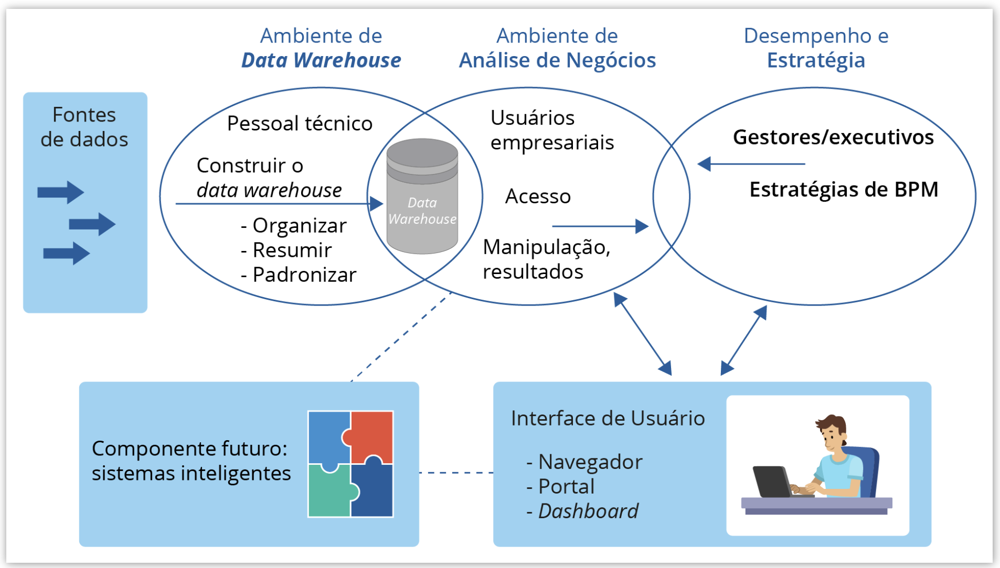
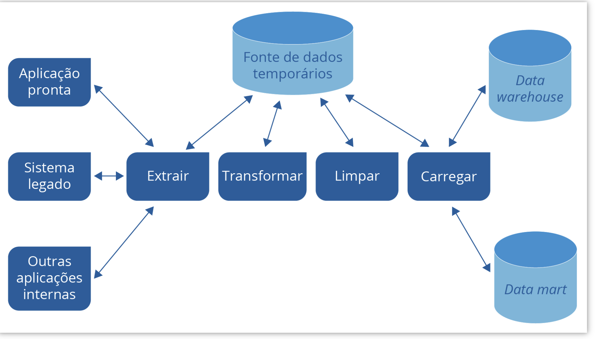
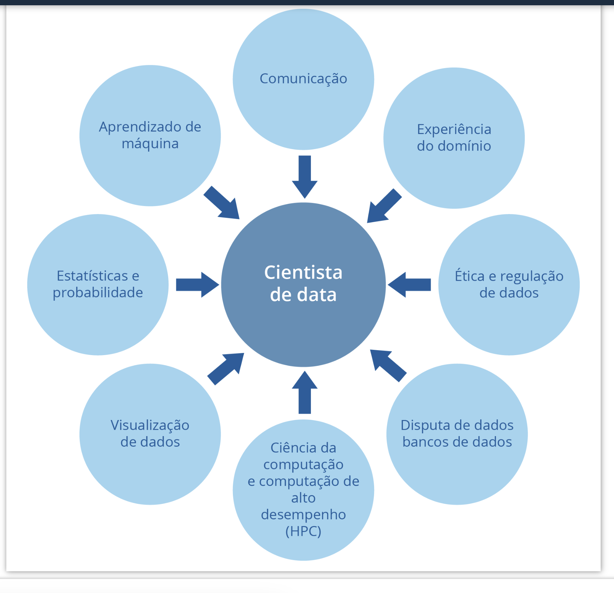

# Bem-vindo(a) à disciplina de Prática de Banco de Dados

## Introdução

Seja bem-vindo(a)! Neste curso, você será introduzido aos princípios fundamentais de **Business Intelligence (BI)**, explorando as tecnologias e ferramentas envolvidas na extração e qualificação de dados. Iremos cobrir tópicos como **Data Warehouse (DW)**, **Dashboard**, **On-Line Analytical Processing (OLAP)** e **ETL**. Além disso, discutiremos outros tipos de banco de dados, incluindo os orientados a objetos e objeto-relacional.

### Objetivos de Aprendizado

- Identificar e compreender os princípios de Business Intelligence.
- Reconhecer a importância das ferramentas e tecnologias em BI.

## Business Intelligence (BI)

No ambiente de negócios competitivo de hoje, as empresas, tanto públicas quanto privadas, enfrentam o desafio de adaptar seus planejamentos estratégicos à evolução constante do mercado. O BI surge como uma resposta tecnológica para promover decisões ágeis, estratégicas e eficazes, necessárias para navegar pela complexidade crescente e pela demanda por inovação operacional.

### Reflexão

No futebol, a tecnologia desempenha um papel crucial ao fornecer dados detalhados sobre o desempenho dos jogadores. Isso levanta uma questão interessante: **Como o Business Intelligence poderia ser aplicado no futebol para auxiliar as comissões técnicas?**

## Um Pouco da História

O conceito de Business Intelligence evoluiu significativamente ao longo das décadas:

- **Anos 70**: Os sistemas de informações gerenciais (MIS) começaram a gerar relatórios estáticos.
- **Anos 80**: Evolução para suporte a extrações dinâmicas de relatórios multidimensionais e análises de tendências.
- **Anos 90**: O termo "Business Intelligence" foi popularizado pelo Gartner Group, incorporando inteligência artificial e outras funcionalidades.
- **Anos 2000**: Consolidação de produtos empresariais em torno do BI.

## Definição de BI

Business Intelligence é um termo abrangente que inclui tecnologias, ferramentas, aplicativos, metodologias e uma arquitetura projetada para melhorar a gestão empresarial através da organização, análise e monitoramento de informações.

### Aplicações em BI

As ferramentas de BI são essenciais em sistemas como Sistema de Apoio à Decisão (SAD) e Sistema de Informação Gerencial (SIG), auxiliando gestores na execução de planejamentos estratégicos eficientes.

## Arquitetura de BI

A arquitetura de BI abrange desde a entrada de dados até a visualização por meio de dashboards, essencial para o crescimento dos negócios e aprimoramento das decisões empresariais.

### Considerações Finais

A integração de BI nos processos empresariais exige uma compreensão profunda das tecnologias e uma aplicação cuidadosa das melhores práticas para garantir que as decisões sejam baseadas em dados precisos e atualizados.

Espero que este curso desperte seu interesse e forneça as ferramentas necessárias para explorar o fascinante mundo do Business Intelligence. Vamos começar?

#PraCegoVer: Desenho esquemático que inicia com um retângulo azul claro a esquerda da imagem com três setas espessas azuis apontando para direita. Na direita deste retângulo temos três circulos que se interseccionam sendo o primeiro o ambiente de Data Warehouse, o segundo o Ambiente de Análise de Negócios e o terceiro o Desempenho e Estratégia. No Ambiente de Data Warehouse esta descrito internamente no círculo que o responsável é o Pessoal Técnico que construi o data warehouse (organiza, resume e padroniza) e tem uma seta que aponta para interseção com o Ambiente de Análise de Negócios onde tem um cilindro descrito como Data Warehouse. No Ambiente de Anaĺise de Negócios esta descrito internamente no círculo que os responsáveis são os Usuários empresariais que tem acesso, manipulação e resultados e, tem um seta interna que aponta para Desempenho e Estratégia. Em Desempenho e Estratégia esta descrito internamente no círculo que o responsável são os Gestores/Executivos pelas Estratégias de BPM e tem uma seta que retorna para Usuários empresariais. Também tem um retangulo azul abaixo de Usuários empresariais com uma linha tracejada vinda deste onde esta descrito internamente “Componente futuro: sistemas inteligentes” e tem um desenho de um quebracabeça multicolorido ao lado desta descrição. A direita deste retangulo azul tem outro retangulo azul conectado por uma linha tracejada com a seguinte descrição “Interface de Usuário: navegador, portal e Dashboard”. Este último retangulo esta com setas bidirecionais apontadas para o círculo do Ambiente de Anaĺise de Negócios e Desempenho e Estratégia.

Em suma, um sistema de Business Intelligence é composto basicamente de quatro componentes essenciais: um ambiente de Data Warehouse , um ambiente de análise de negócio, um sistema de mineração de dados ( data mining ) e Business Process Management (BPM) para gerenciamento de desempenho e uma interface para visualização e interação com usuário como um dashboard (Figura 4.2).

## Continuação: Business Intelligence e suas Ferramentas

Embora o conceito de Business Intelligence seja amplamente utilizado pelas empresas, ele abrange outras ferramentas importantes como **Data Warehouse**, **Data Mart**, e **Dashboard**, que serão foco de estudos no próximo tópico.

### Vamos Praticar

O conceito de Business Intelligence engloba várias tecnologias que, quando integradas, fornecem suporte computacional essencial para as decisões de negócio. Duas estruturas fundamentais para o BI são DW (Data Warehouse) e suas aplicações. Assinale a alternativa correta que indica uma aplicação em que o BI pode ser implementado:

- a) KPI.
- b) B2C.
- c) CRM.
- d) ERP.
- e) B2B.

## Ferramentas de Business Intelligence

O uso de Business Intelligence não se limita apenas a investir em Tecnologia da Informação, apesar de ser fundamental para o BI. Este tópico abordará as principais ferramentas de BI.

### Data Warehouse (DW) e Data Mart

Com o vasto volume de informações disponíveis e geradas, as empresas enfrentam o desafio de extrair as mais importantes e relevantes. Essas informações podem estar em diferentes formatos e meios, como relatórios em papel, digitais, e-mails e mensagens em redes sociais.

#### Data Warehouse

O **Data Warehouse** é um sistema de armazenamento que consolida dados de vários departamentos de uma organização em um único local seguro. Ele permite análises de dados seletivas e rigorosas, transformando-se numa ferramenta crucial para o suporte à tomada de decisão.

**Figura 4.3 - Data Warehouse**  
  
_Fonte: Paisan Homhuan / 123RF._  
_Descrição: Três cilindros azuis com setas direcionais apontando para a palavra ETL, envolvida por setas que completam um círculo, com uma seta apontando para um cilindro grande com um símbolo de engrenagem internamente e a descrição "Data Warehouse" em letras grandes._

O DW armazena dados em um único local, originados de diversas fontes, facilitando o acesso e a análise.

### Quadro Comparativo: Bases de Dados Operacionais vs. Data Warehouse

| Aspecto                   | Bases de Dados Operacionais | Data Warehouse               |
| ------------------------- | --------------------------- | ---------------------------- |
| Objetivos                 | Operacionais                | Registro Histórico           |
| Tipo de Acesso            | Leitura/Escrita             | Apenas Leitura               |
| Acesso                    | Transações Predefinidas     | Questões Ad-hoc e Relatórios |
| Volume de Dados Acessados | Poucos registros por vez    | Muitos registros por vez     |
| Atualização de Dados      | Em tempo real               | Carregamentos periódicos     |
| Estrutura Otimizada       | Atualizações                | Processamento de Questões    |

### Data Mart

O **Data Mart** é uma versão reduzida do Data Warehouse que suporta a tomada de decisão em áreas ou assuntos específicos, não abrangendo a organização como um todo. Ele é um subconjunto de informações específicas do Data Warehouse, voltadas para áreas ou assuntos particulares da organização.

## Análise de Dados com Ferramentas OLAP

As ferramentas OLAP (On-Line Analytical Processing) são projetadas para realizar análises complexas das informações armazenadas nos repositórios de um Data Warehouse. Elas permitem uma visualização e análise dos dados de forma mais ágil, facilitada e consistente, crucial para a tomada de decisão gerencial.

### Características e Benefícios do OLAP

- **Flexibilidade**: Permite análises multidimensionais dos dados.
- **Acessibilidade**: Suporta múltiplos usuários e proporciona fácil acesso aos dados.
- **Transparência**: Facilita a recuperação de informações-chave, promovendo uma melhor tomada de decisão.

OLAPs são como um cubo mágico de dados; ao manipular as dimensões do cubo, os gestores podem obter diferentes perspectivas e insights sobre os mesmos dados, facilitando análises profundas e decisões estratégicas.

## Tipos de Ferramentas OLAP

As ferramentas OLAP permitem a análise multidimensional de dados armazenados em repositórios, independentemente de sua localização. Existem diferentes tipos de ferramentas OLAP, cada uma com características próprias:

- **ROLAP (Relacional OLAP)**: Interage com bancos de dados relacionais e utiliza ferramentas da camada de usuário para analisar os dados. Dependem de um gerenciador de base de dados relacionais para armazenar e gerenciar os dados.
- **MOLAP (Multidimensional OLAP)**: Utiliza bases de dados multidimensionais, oferecendo suporte a várias formas de leitura e consultas de dados.
- **HOLAP (Hybrid OLAP)**: Combina a escalabilidade de ROLAP com a velocidade de MOLAP, proporcionando uma ferramenta eficaz e versátil.

### Processos OLAP segundo Turban et al. (2009)

- **MOLAP**: Utiliza uma estrutura de cubo para armazenar dados, permitindo múltiplas visualizações de todas as dimensões.
- **ROLAP**: Utiliza bancos de dados relacionais para realizar consultas dinâmicas.
- **WOPAL**: Emprega navegadores web para acesso aos dados.

#### Manipulação de Cubos

- **Drill-down**: Análise de dados do mais geral para o mais específico (ex: do faturamento anual ao diário).
- **Roll-up**: Análise de dados do mais específico para o mais geral (ex: do faturamento diário ao anual).
- **Slice and dice**: Realiza cortes e reduções nos dados para filtrar ou limitar informações baseadas em uma ou mais condições.
- **Pivot (Rotate)**: Permite percorrer todas as visualizações possíveis dos dados, mudando a forma de representação.

As ferramentas OLAP podem ser usadas sozinhas ou em combinação com ferramentas de mineração de dados dentro de um projeto de Business Intelligence.

## Ferramentas de Extraction, Transformation and Loading (ETL)

As ferramentas ETL são cruciais no processo de Business Intelligence. Elas são responsáveis por:

1. **Extração**: Coletar dados das bases operacionais da organização.
2. **Transformação**: Modificar os dados para gerar informações valiosas e relevantes.
3. **Loading (Carregamento)**: Armazenar as informações transformadas em um repositório para facilitar o acesso.

Este processo é essencial para o carregamento das tabelas do Data Warehouse. A figura abaixo apresenta uma visão macro do processo de uma ferramenta ETL.

**Figura X.X - Processo de ETL**  
  
_Fonte: [Inserir fonte aqui]._  
_Descrição: [Inserir descrição da figura aqui]._

As ferramentas ETL garantem que os dados coletados sejam limpos, consistentes e prontos para serem analisados, formando a espinha dorsal do armazenamento de dados em um projeto de BI.

## Detalhamento do Processo ETL

### Extrair

A operação "extrair" é crucial no processo de ETL, envolvendo o acesso a dados de diversas fontes, como aplicações prontas, sistemas legados e outras aplicações internas. Esta etapa é responsável por coletar os dados que serão transformados e carregados.

**#PraCegoVer:** Diagrama esquemático que inicia com três retângulos azuis à esquerda, descritos como "Aplicação pronta", "Sistema legado" e "Outras aplicações internas", apontando com setas bidirecionais para outro retângulo azul denominado "Extrair".

### Transformar e Limpar

As operações de "transformar" e "limpar" aplicam regras de negócio para normalizar e corrigir os dados antes de serem armazenados no repositório. Estas etapas envolvem:

- **Transformar:** Aplicação de regras de negócio e normalização dos dados.
- **Limpar:** Remoção de dados que não respeitam as regras de negócio ou que estão incompletos.

**Problemas Comuns na Extração de Dados:**

- Chaves primárias inconsistentes.
- Inconsistências nos dados.
- Dados inválidos (corrigidos durante o processo de limpeza).
- Sinônimos e homônimos (dificuldade em reconhecer dados repetidos).
- Lógica de processo intrínseca.

### Carregar

Finalmente, os dados já transformados e limpos são armazenados no **Data Warehouse**. Este estágio conclui o ciclo do ETL, garantindo que os dados estejam prontos para análises e decisões empresariais.

## Dashboard

Dashboards são ferramentas visuais que proporcionam aos usuários uma interface clara para a apresentação de informações, facilitando a tomada de decisão.

### Características de um Dashboard Eficaz

- Utiliza gráficos para evidenciar tendências e facilitar comparações.
- Fornece apenas as informações mais relevantes para os objetivos definidos.
- Conduz a conclusões significativas sem a necessidade de análises profundas por parte do usuário.

### Desenvolvimento Orientado à Ação

Um Dashboard ideal, segundo Kaushik (2010), deve:

- Apresentar métricas de forma clara e progressiva.
- Interpretar e contextualizar os dados, identificando tendências e riscos.
- Propor ações e passos seguintes, facilitando a resolução de problemas.
- Estimar impactos das análises na organização e nos clientes.

Dashboards são parte integrante das ferramentas de um Data Warehouse e têm ganhado importância com o avanço da Data Science.

## Vamos Praticar

Assinale a alternativa correta que indica uma ferramenta usada para visualização de dados em um Data Warehouse:

- a) Dashboard.
- b) OLAP.
- c) Excel.
- d) ETL.
- e) Data mining.

## Introdução à Data Science

### Desafios e Foco da Data Science

No cenário atual, onde a internet é uma fonte crucial de dados, a Data Science se concentra principalmente na dimensão do volume de dados, utilizando estruturas como Hadoop e Spark para processar grandes conjuntos de dados de forma paralela. Além disso, também se foca em velocidade e variedade, características essenciais para aplicações de dados rápidas.

### Interdisciplinaridade da Data Science

Data Science é uma área multidisciplinar que combina estatística e computação para interpretar dados para tomada de decisão. Esta ciência também se interconecta com aprendizado de máquina e mineração de dados, focando na melhoria da tomada de decisões.

### Técnicas de Data Science

- **Clustering:** Identificação de grupos de clientes com comportamentos similares.
- **Association-rule mining:** Identificação de padrões de produtos frequentemente comprados juntos.

## Breve História da Data Science

- **Década de 1960:** O termo "Ciência dos Dados" foi usado inicialmente para substituir "Ciência da Computação".
- **Década de 2000:** Estabelecida como uma disciplina independente.
- **2012:** Descrição do papel do cientista de dados como o "trabalho mais sexy do século 21" pela Harvard Business Review (DAVENPORT; PATIL, 2012, online).

A complexidade de dominar todas as áreas que compõem a Data Science é elevada, sendo comum que cientistas de dados tenham conhecimento aprofundado em apenas alguns de seus subcampos. No entanto, é crucial estar ciente da contribuição de cada área para um projeto de ciência de dados.

**Figura 4.6 - Disciplinas envolvendo Data Science**
_Descrição da figura: [Descrição detalhada da figura]._

## Detalhamento das Tarefas em Data Science

Data Science visa resolver problemas do mundo real através da identificação de padrões nos dados, classificando-os em quatro categorias principais de tarefas:

1. **Agrupamento ou Segmentação (Clustering)**: Classificação de elementos como clientes e produtos, frequentemente utilizada para analisar padrões de compra durante promoções.
2. **Detecção de Anomalia (Outlier)**: Identificação de casos que divergem do padrão típico de um conjunto de dados.
3. **Mineração de Regras de Associação (Association-rule Mining)**: Estratégia usada para venda cruzada, sugerindo produtos relacionados ou complementares aos clientes.
4. **Previsão (Prediction)**: Análises preditivas como a previsão de taxas de abandono ou cancelamento.

Data Science é uma área ampla que abrange diversas tecnologias, incluindo mineração de dados e outros métodos, importantes para a tomada de decisões.

### Vamos Praticar

Assinale a alternativa correta com relação à ciência dos dados:

- a) Extração, transformação e carregamento.
- b) Técnica de agrupamento.
- c) Volume, variedade e velocidade.
- d) OLAP.
- e) Data Mart.

## Outras Tecnologias de Banco de Dados

### Banco de Dados Distribuído

Os bancos de dados podem ser centralizados ou distribuídos em vários locais. Os bancos de dados distribuídos têm vantagens como maior flexibilidade no desenvolvimento de aplicações, confiabilidade e disponibilidade. A falha em um site de banco de dados não compromete a totalidade do sistema, melhorando o desempenho e facilitando a expansão.

**Figura 4.7 - Uma visão de banco de dados distribuído**  
_Fonte: macrovector / 123RF._  
_#PraCegoVer: Apresenta um cilindro laranja degradê grande ao centro de outros seis cilindros menores azuis degradê conectados por um fio grosso azul._

### Banco de Dados Orientado a Objetos

Orientados a objetos, os bancos de dados armazenam informações como objetos, de forma persistente, permitindo que sejam recuperados e compartilhados após o término de programas. Essa tecnologia aplica princípios de programação orientada a objetos a bases de dados.

### Banco de Dados NoSQL

Os sistemas de banco de dados NoSQL são projetados para gerenciar dados estruturados, semiestruturados e não estruturados. Eles são ideais para lidar com grandes volumes de dados distribuídos, usando processamento paralelo para melhorar o desempenho e oferecendo disponibilidade global.

**Características do NoSQL:**

- Utilização do processamento paralelo.
- Distribuição em escala global.
- Armazenamento baseado em chave/valor.

Exemplos de bancos de dados NoSQL incluem MongoDB, Cassandra e Redis.

### Vamos Praticar

Com base no texto, assinale a alternativa correta que apresenta uma tecnologia de banco de dados adequada para trabalhar com estruturas de Big Data:

- a) Banco de dados relacional.
- b) Banco de dados NoSQL.
- c) Banco de dados distribuído.
- d) Banco de dados orientado a objetos.
- e) Banco de dados armazenamento RDF.
